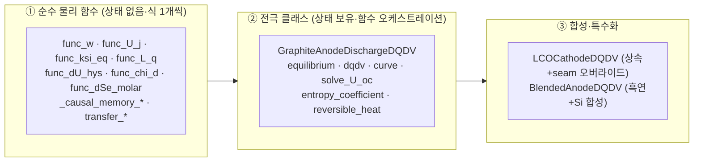
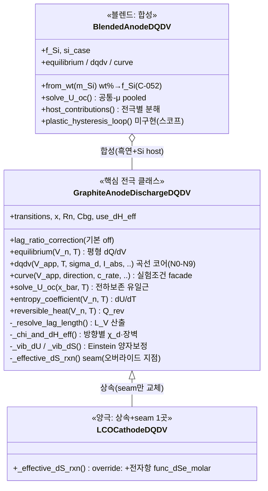
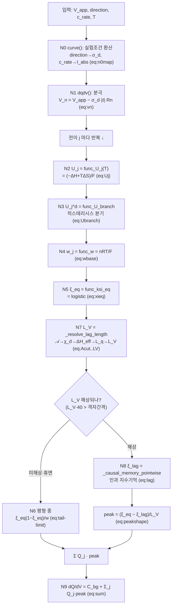
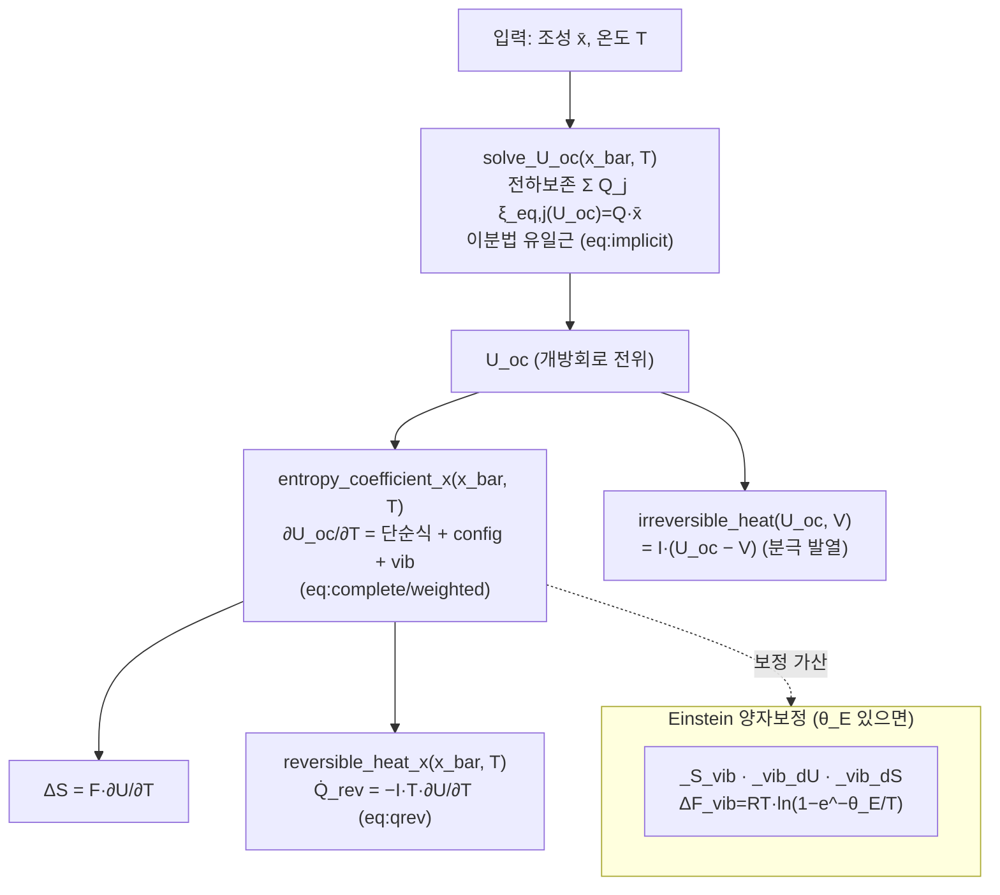
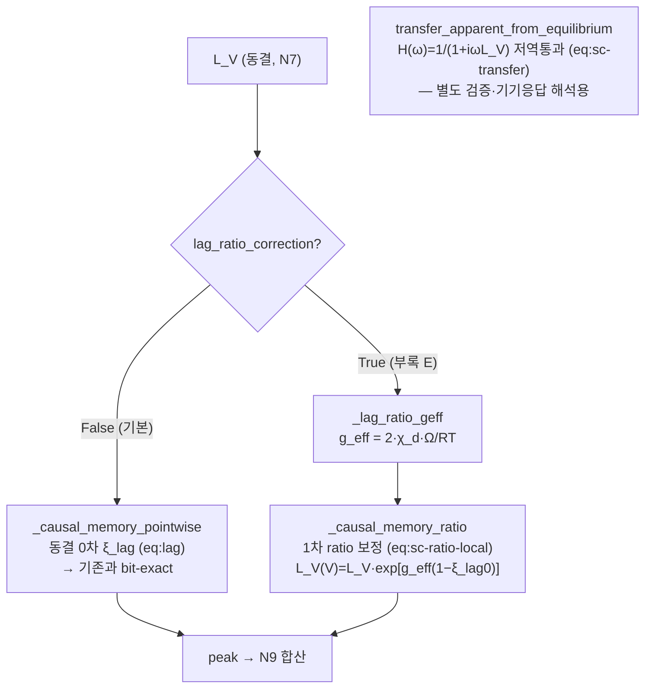
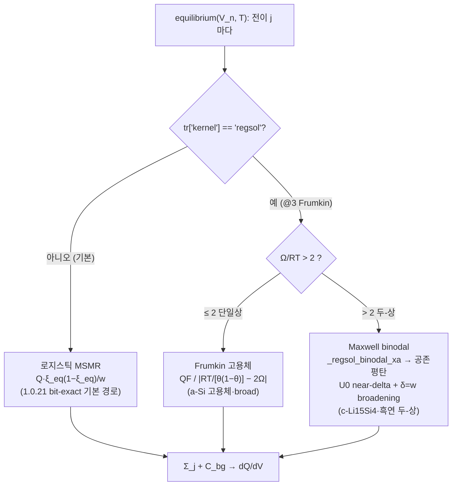

# Anode_Fit_v1.0.24.py — 코드 이해 가이드 (구조·플로우·사용법·옵션·변수)

> 목적: **1734줄** 구현을 **구조도·플로우차트·사용법·옵션표·변수사전**으로 빠르게 파악. GitHub가 아래 mermaid 를 그림으로 렌더한다.
> 원칙: 코드는 문건(부록 B `sec:appendix-code`)의 식을 그대로 구현 — 각 함수 옆에 대응 식 번호를 적었다.
> 레벨 순서:
> - **개념**: A(30초 개요) → B(클래스 구조도) → C(dQ/dV 플로우) → **C+([v1.0.24] 평형 커널 분기)** → D(열특성 플로우) → E(자기일관 옵션) → F(함수 사전)
> - **실무**: **G(옵션 전수) → H(사용법 복붙예) → I(상수 전수) → J(변수·기호 사전)**
> - 피팅 *절차*(tier·초기값·경계·수렴)는 별도 `FITTING_GUIDE.md`. 여긴 코드 *구조·API*.
> - v1.0.24 반영분(@3 regsol·@5 5-feature·6-gallery·LCO 토글·전수감사)까지 최신.

---

## 버전 A — 30초 개요 (멘탈 모델)

**이 코드가 하는 일**: 물리 파라미터(전이별 중심전위·폭·용량·활성화 등)를 넣으면 → **dQ/dV 곡선(ICA)** 과 **열특성(엔트로피계수·가역발열)** 을 낸다. 순방향(forward) 시뮬레이터.

**3개 층으로 본다:**



- **①층**은 stateless 함수 — 하나가 식 하나(예: `func_ksi_eq` = 평형 진행률 logistic, eq:xieq).
- **②층** `GraphiteAnodeDischargeDQDV` 가 핵심 — ①의 함수들을 순서대로 엮어 곡선/열특성을 만든다.
- **③층**: LCO 는 ②를 **상속**해 seam(`_effective_dS_rxn`) 한 곳만 바꿔 전자항 추가; Blend 는 ②를 **합성**(흑연 host + Si host).

**한 줄 데이터 흐름**: `실험조건 → 내부전위 V_n → (전이별) 평형 진행률 ξ_eq → 봉우리 모양 → Σ 가중합 → dQ/dV`.

---

## 버전 B — 클래스 구조도



**핵심 통찰**: LCO 는 흑연과 **거의 같다** — 딱 한 메서드(`_effective_dS_rxn`, 전자항 plug-in)만 오버라이드. 나머지 물리(중심전위·폭·히스·꼬리)는 전부 상속. Blend 는 흑연 인스턴스 2개(흑연 host + Si host)를 **공통 전위축**에서 합친다.

---

## 버전 C — dQ/dV 계산 플로우챠트 (curve → dqdv, 노드 N0~N9)

문건의 노드 사슬 N0~N9 가 `dqdv()` 한 메서드 안에서 이 순서로 실행된다:



**읽는 법**: 왼쪽 위 입력에서 시작해 전이(staging peak)마다 N2~N9 를 돌고, 마지막에 배경 `C_bg` 위에 전이별 봉우리를 합산. **충전**은 `eq:reversal`로 진행축 상한을 뒤집는 것 외엔 같은 경로(거울). **미해상 가드**(N6 분기)가 기본 흑연의 휴면 꼬리를 평형 종으로 매끄럽게 잇는다(불연속 없음 — 곡선 QA 확인).

---

## 버전 D — 열특성 플로우챠트 (Part T, dQ/dV 와 별개 경로)

조성 x̄ 를 넣으면 열특성을 내는 경로. `dqdv` 와 독립이다:



**핵심**: `solve_U_oc` 가 **중심식** — 단순히 OCV 표를 읽지 않고 전하보존식을 풀어 내부 전위를 결정(프로젝트 검수 7항 ②). 엔트로피계수는 3항(단순 ΔS⁰/F + config 봉우리 + vib 양자보정)의 합. LCO 는 여기에 seam 으로 전자항이 하나 더 붙는다.

---

## 버전 E — 자기일관 옵션 경로 (v1.0.24 신규·부록 E)

`dqdv` 의 N7→N8 구간에 **선택적 고정밀 경로**가 추가됨. 기본 off → 기존과 bit-exact:



**요지**: 동결 0차(`_causal_memory_pointwise`)가 기본. `lag_ratio_correction=True` 켜야 상태의존 1차 보정(`_causal_memory_ratio`)이 작동하고, Ω=0 이면 자동으로 동결로 정확 회수. `transfer_*` 는 dqdv 본류엔 안 들어가고 주파수영역 검증용(균일격자 FFT). 상세 = 부록 E.

---

## 버전 F — 함수·메서드 사전 (층별 · 식 매핑)

### ① 순수 물리 함수 (모듈, stateless)
| 함수 | 하는 일 | 식 |
|---|---|---|
| `func_w` | 폭 w = nRT/F | eq:wbase |
| `func_U_j` | 평형 중심 U_j = (−ΔH+TΔS)/F | eq:Uj |
| `func_ksi_eq` | 평형 진행률 ξ_eq = logistic | eq:xieq |
| `func_dU_hys` | spinodal 히스 gap ΔU_hys | eq:dUhys |
| `func_U_branch` | 분기 중심 U_j^d | eq:Ubranch |
| `func_chi_d` | 방향별 전달계수 χ_d | eq:chid |
| `func_dH_a_eff` | 유효 장벽 ΔH_a−χ_dΩ | eq:dHeff |
| `func_L_q` | 용량축 지연 길이 L_q | eq:Lqfull |
| `func_dSe_molar` | 전자항 몰 엔트로피(LCO) | eq:dSemolar |
| `_causal_memory_pointwise` | 동결 인과 기억 ξ_lag | eq:lag |
| `_causal_memory_ratio` ★ | 1차 ratio 보정(부록 E) | eq:sc-ratio-local |
| `transfer_apparent_from_equilibrium` ★ | 전달함수 저역통과 | eq:sc-transfer |
| `_finite`·`_finite_pos`·`_finite_nonneg` | 입력 유한·범위 가드 | — |

### ② GraphiteAnodeDischargeDQDV (핵심 클래스)
| 메서드 | 하는 일 | 식·노드 |
|---|---|---|
| `__init__` | 모델 구성·seed L_V | — |
| `_n_factor`·`_width`·`_dwdT` | 폭 다중도·폭·∂w/∂T | eq:wbase |
| `_vib_theta`·`_S_vib`·`_vib_dU`·`_vib_dS` | Einstein 양자보정 | Part T |
| `_chi_d`·`_chi_and_dH_eff`·`_lag_ratio_geff` | 방향별 전달계수·유효장벽·g_eff | eq:chid·dHeff |
| `_resolve_lag_length` | 지연 길이 L_V | eq:Acut→LV (N7) |
| **`equilibrium`** | 평형(|I|→0) dQ/dV | eq:eqpeak |
| **`dqdv`** | 곡선 코어 | N0~N9 |
| **`curve`** | 실험조건 facade | eq:n0map |
| `_effective_dS_rxn` | seam(LCO 오버라이드 지점) | — |
| **`entropy_coefficient`(_x)** | ∂U_oc/∂T | eq:complete |
| **`reversible_heat`(_x)** | 가역 발열 Q̇_rev | eq:qrev |
| **`solve_U_oc`** | 전하보존 유일근 | eq:implicit |
| `irreversible_heat` | 분극 발열 | — |
| `_direction_to_sigma` | 방향 문자열→σ_d | — |

### ③ 특수화
| 클래스·메서드 | 하는 일 |
|---|---|
| `LCOCathodeDQDV._effective_dS_rxn` | 흑연 상속 + 전자항 seam 가산(전이 electronic 게이트) |
| `BlendedAnodeDQDV.__init__`·`from_wt` | 흑연+Si 합성·wt%→f_Si 환산(C-052) |
| `BlendedAnodeDQDV.equilibrium/dqdv/curve/solve_U_oc` | 공통 전위축 합성(host 곱·pooled 근) |
| `BlendedAnodeDQDV.host_contributions` | 전극별 기여 분해 |
| `plastic_hysteresis_loop`·`nonadditive_correction` | 미구현 스텁(GS-1 스코프 경계 표시) |

★ = v1.0.24 신규(부록 E 자기일관 해법).

---

## 버전 C+ — 평형 커널 분기 (@3 regsol vs 로지스틱) [v1.0.24 신규]

`equilibrium()` 은 **전이별로 커널을 선택**한다. `dqdv()`(관측·유한율속)·가역열·솔버는 이 분기를 안 타고 **항상 로지스틱**이다(감사 F-2 scope 한정):



- **기본**(전이 dict 에 `'kernel'` 키 없음) = 로지스틱 → 1.0.21 bit-exact.
- `'kernel':'regsol'` + `'Omega'` = @3 Frumkin. Ω<2RT 고용체 / Ω>2RT 는 `_regsol_binodal_xa` 가 **자동으로** Maxwell 공존(near-delta) 처리.
- ★**scope 주의**: regsol 은 `equilibrium()` 평형 baseline 전용. 유한율속 `dqdv()`·`entropy_coefficient()`·`solve_U_oc()` 는 `'kernel'` 무시(로지스틱).

---

## 버전 G — 옵션 전수 (플래그·기본값·효과)

### G.1 생성자 옵션 — `GraphiteAnodeDischargeDQDV` / `LCOCathodeDQDV` 공통
| 옵션 | 기본 | 의미·효과 |
|---|---|---|
| `transitions` | (필수) | 전이 dict 리스트 (키 = G.3) |
| `x` | 0.5 | 대표 조성(χ 기본값 소스) |
| `Rn` | 0.0 | 분극 저항 — V_n = V_app − σ_d·\|I\|·Rn |
| `Cbg` | 0.0 | 배경 dQ/dV (float 또는 callable(V)) |
| `chi` | None(→x) | 전달계수 χ 기준값 |
| `chi_split` | `func_chi_d` | 방향별 χ_d 규칙 (callable 교체 가능) |
| `use_dH_eff` | True | ΔH_a^eff = ΔH_a − χ_d·Ω 보강(히스 방향비대칭) |
| `z_cut` | 4.357 | 꼬리 컷 affinity (★A_cap clamp 로 n=1 실현 z=4.0≈7%, 감사 F-6) |
| `A_cap_RT` | 4.0 | 컷 상한 A ≤ A_cap·RT |
| `seed_T/seed_I/seed_Q_cell` | 298.15 / 0.1 / 1.0 | L_V seed(진단·초기값) 조건 |
| `lag_ratio_correction` | False | 부록 E 1차 ratio 보정(True) / 동결 0차(False, bit-exact) |

### G.2 클래스 전용 옵션
| 옵션 | 클래스 | 기본 | 효과 |
|---|---|---|---|
| `include_electronic_entropy` | LCO | **False** | 전자항: 기본 제외(상온 커브 불변)·True 는 ∂U/∂T(가역열·다온도)에 활성 = v1.0.19 거동 |
| `f_Si` | Blend | (필수) | Si 용량 분율 [0,1) |
| `si_case` | Blend | `'sic'` | Si 케이스셋 `'elemental'`/`'siox'`/`'sic'` |
| `graphite_transitions` | Blend | None(→LIT) | 흑연 host 전이(4/5/6 선택 가능) |
| `si_transitions` | Blend | None(→케이스셋) | Si host 전이 직접 지정 |
| `si_stress_offset` | Blend | None | Si ΔV 응력 오프셋 훅(GS-1 스코프) |

### G.3 전이 dict 키 (`transitions` 각 원소)
| 키 | 필수? | 의미 |
|---|---|---|
| `'U'` | (또는 dH/dS) | 평형 중심전위 [V] |
| `'dH_rxn'`,`'dS_rxn'` | U 대체 | 열역학 → U(T)=(−ΔH+TΔS)/F (온도의존·stage-2L 서명) |
| `'w'` 또는 `'n'` | 택1(없으면 n=1) | 폭 w = n·RT/F [V] (n=MSMR ω) |
| `'Q'` | 필수 | 전이 용량 가중 |
| `'Omega'` | 선택 | 정칙용액 상호작용 [J/mol] (히스·regsol) |
| `'kernel'` | 선택 | `'regsol'` → @3 Frumkin(**equilibrium 전용**); 없으면 로지스틱 |
| `'delta'` | 선택(regsol) | regsol kinetic 폭(없으면 w) |
| `'dH_a'`,`'dS_a'`,`'dVdq_qa'` | 선택 | 유한율속 활성화(dqdv 꼬리) |
| `'electronic'` | 선택(LCO) | True → 전자항 게이트 대상(토글 ON 시) |
| `'x_center'` | 선택(LCO) | 전자항 MIT 중심 조성 |
| `'theta_E'` | 선택 | Einstein 온도 [K] (vib 양자보정) |
| `'n_T1'`,`'n_T_ref'` | 선택 | 폭 n(T)=n+n_T1(T−T_ref) 온도의존 |

---

## 버전 H — 사용법 (복붙 실행 예)

> ★파일명에 점(`.`)이 있어 `import Anode_Fit_v1.0.24` 는 안 된다. 실제 로드는 `importlib.util`:
> `spec=importlib.util.spec_from_file_location('af','Anode_Fit_v1.0.24.py'); m=importlib.util.module_from_spec(spec); spec.loader.exec_module(m)` 후 `m.GraphiteAnodeDischargeDQDV`. 아래는 API 를 `from ... import` 로 간결 표기(재현 스크립트 = `results/comp_v24/*.py`).

### H.1 흑연 기본 dQ/dV
```python
import numpy as np
V = np.linspace(0.05, 0.30, 500)
gr = GraphiteAnodeDischargeDQDV(GRAPHITE_STAGING_LIT, Cbg=0.05)
y_eq  = gr.equilibrium(V, T=298.15)                                   # 평형(|I|→0)
y_obs = gr.curve(V, direction="discharge", c_rate=0.1, Q_cell=1.0)   # 유한율속(꼬리)
```

### H.2 해상도 사다리 4/5/6 feature — v1.0.24
```python
gr4 = GraphiteAnodeDischargeDQDV(GRAPHITE_STAGING_LIT)         # 4-전이 기본(bit-exact)
gr5 = GraphiteAnodeDischargeDQDV(GRAPHITE_STAGING_XRD_v1024)   # 5-feature XRD(@5, stage-2L 분리)
gr6 = GraphiteAnodeDischargeDQDV(GRAPHITE_STAGING_MSMR6_LIT)   # 6-gallery MSMR(고분해능)
```

### H.3 @3 Si Frumkin regsol 커널 (opt-in)
```python
si_trs = [{'U':0.28,'Omega':1500.,'Q':0.4,'w':0.05,'kernel':'regsol'},   # 고용체 Ω<2RT
          {'U':0.43,'Omega':8000.,'Q':0.15,'w':0.006,'kernel':'regsol'}] # 두-상 Ω>2RT(binodal 자동)
y_si = GraphiteAnodeDischargeDQDV(si_trs, Cbg=0.).equilibrium(V_si, 298.15)  # ★equilibrium 에서만
```

### H.4 LCO + 전자항 토글
```python
lco   = LCOCathodeDQDV(LCO_MSMR_LIT)                                   # 기본 OFF(상온 커브)
lco_T = LCOCathodeDQDV(LCO_MSMR_LIT, include_electronic_entropy=True)  # ON(가역열·다온도용)
y = lco.curve(V_lco, direction="charge", c_rate=0.1)                   # ★LCO 충전=탈리튬화(라벨 그대로 주면 자동 σ_d)
```

### H.5 흑연+Si 블렌드
```python
bl  = BlendedAnodeDQDV(f_Si=0.2, si_case='sic')                        # 용량분율 직접
bl2 = BlendedAnodeDQDV.from_wt(m_Si=0.1, si_case='sic')                # wt%→f_Si 환산(C-052)
y_bl = bl.equilibrium(V, 298.15)
gr_part, si_part = bl.host_contributions(V, 298.15)                    # 전극별 기여 분해
```

### H.6 피팅 (scipy.curve_fit)
```python
from scipy.optimize import curve_fit
def model(V, *p):                       # p = [U1,w1,Q1, ..., UN,wN,QN, Cbg]
    trs=[{'U':p[3*i],'w':p[3*i+1],'Q':p[3*i+2]} for i in range(N)]
    return GraphiteAnodeDischargeDQDV(trs, Cbg=p[-1]).equilibrium(V, 298.15)
popt,_ = curve_fit(model, V_data, dQdV_data, p0=p0, bounds=(lo,hi), maxfev=200000)
```
(tier·초기값·경계·수렴 판정 = `FITTING_GUIDE.md`.)

### H.7 열특성 (조성 x̄ → OCV·엔트로피·가역열)
```python
U_oc  = gr.solve_U_oc(x_bar=0.5, T=298.15)             # 전하보존 유일근(OCV)
dUdT  = gr.entropy_coefficient_x(0.5, T=298.15)        # ∂U/∂T (엔트로피 계수)
q_rev = gr.reversible_heat_x(0.5, T=298.15, I=0.1)     # −I·T·∂U/∂T (가역 발열)
```

---

## 버전 I — 상수 전수 (언제 뭘 쓰나)

| 상수 | 형태 | 용도 | tier |
|---|---|---|---|
| `GRAPHITE_STAGING_LIT` | 4-전이 | 흑연 **기본**(bit-exact baseline) | 시드(fit-override) |
| `GRAPHITE_STAGING_XRD_v1024` | 5-feature | stage-2L 분리 XRD(@5, opt-in) | U0 문헌·dS 서명 |
| `GRAPHITE_STAGING_MSMR6_LIT` | 6-gallery | 최고분해능 MSMR(opt-in) | U0·ω 문헌·Q 시드 |
| `LCO_MSMR_LIT` | 3-전이 | LCO 양극(전자항 게이트) | 시연값 |
| `SI_ELEMENTAL_LIT`/`SIOX_LIT`/`SIC_LIT` | Si 케이스 | 블렌드 Si host(`si_case`) | 시연·공백표시 |
| `SI_SPECIFIC_CAPACITY` | {elem 1000·siox 1710·sic 3117} | wt%→f_Si(C-052) | tier-A |
| `GRAPHITE_SPECIFIC_CAPACITY` | 372 | 흑연 비용량 | 관례 |
| `SI_CASE_GAPS` | 공백 목록 | '확인 필요' 전건기록(조용한 날조 방지) | — |

★ 전 상수의 U·w·Q 는 **시드(피팅 override 전제)**. U0·ω(문헌 anchor)와 Q(tier-C 시드)의 tier 구분은 각 상수 주석에 명기.

---

## 버전 J — 변수·기호 사전 (기호 ↔ 코드 ↔ 의미)

| 기호 | 코드 식별자 | 의미 | 단위 |
|---|---|---|---|
| V_app | `V_app`(입력) | 인가(측정) 전위 | V |
| V_n | `V_n` | 내부(분극보정) 전위 = V_app−σ_d\|I\|Rn | V |
| U_j | `tr['U']`·`func_U_j` | 전이 j 평형 중심전위 | V |
| U_j^d | `func_U_branch` | 히스 분기중심 | V |
| ξ_eq | `func_ksi_eq` | 평형 진행률(logistic) | — |
| ξ_lag | `_causal_memory_*` | 인과 지연 진행률(유한율속) | — |
| w_j | `func_w`·`tr['w']` | 봉우리 폭 = n·RT/F | V |
| n_j | `tr['n']`·`_n_factor` | 폭 다중도(= MSMR ω_j) | — |
| Ω_j | `tr['Omega']` | 정칙용액 상호작용 | J/mol |
| Q_j | `tr['Q']` | 전이 용량 가중 | (상대) |
| σ_d | `sigma_d` | 방향 부호(탈리튬화 = +1) | ±1 |
| χ_d | `func_chi_d` | 방향별 전달계수 | — |
| ΔH_a^eff | `func_dH_a_eff` | 유효 활성화 엔탈피 = ΔH_a−χ_dΩ | J/mol |
| L_V / L_q | `_resolve_lag_length`/`func_L_q` | 지연 길이(전위/용량축) | V / — |
| C_bg | `Cbg` | 배경 dQ/dV | (dQ/dV) |
| ΔS_e | `func_dSe_molar` | 전자 엔트로피(LCO) | J/mol/K |
| f_Si | `f_Si` | Si 용량 분율 | — |
| θ_E | `tr['theta_E']` | Einstein 온도(vib 양자보정) | K |
| Δ(ΔS) | (XRD dS_rxn 차) | stage-2L 분리 서명 29→0.30 mV/℃ | J/mol/K |

(정식 전수 대응 = 문건 부록 B `tab:symcode`·`tab:inputs`·`tab:nodecode`.)

---

## 부록 — 구현 대응표 원본
정식 물리기호↔코드식별자 대응은 문건 **부록 B**(`\ref{sec:appendix-code}`, tab:symcode·tab:inputs·tab:nodecode)에, 자기일관 옵션은 **부록 E.6**(tab:sc-codemap)에 있다. 본 가이드는 그 구조 요약이다.
