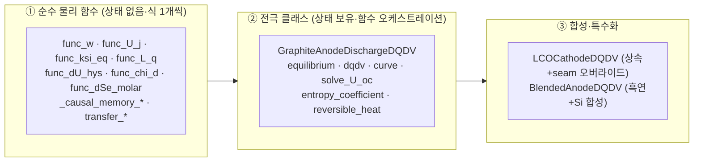
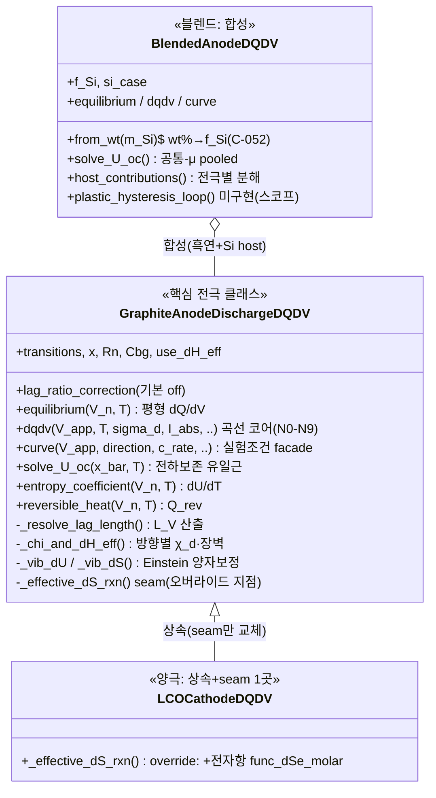
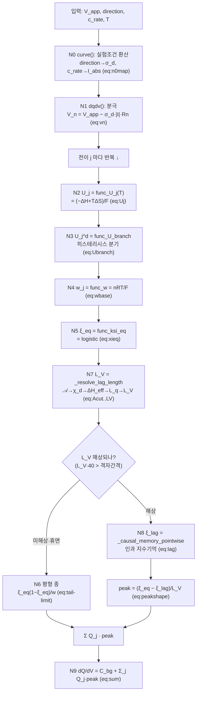
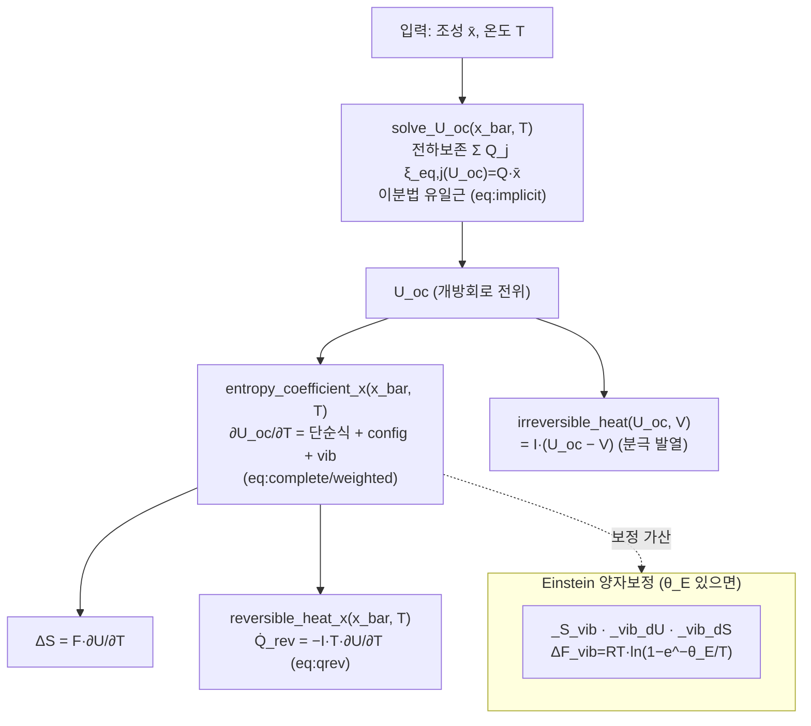
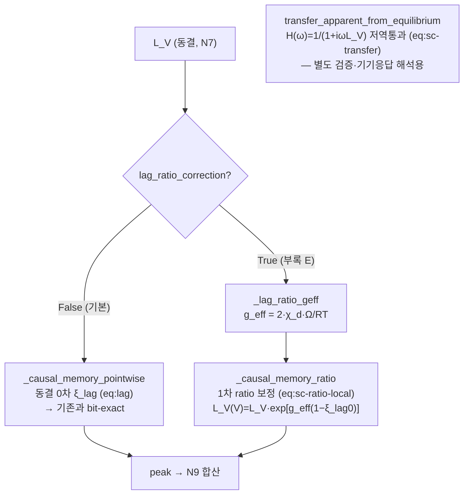

# Anode_Fit_v1.0.24.py — 코드 이해 가이드 (6개 레벨)

> 목적: 1585줄 구현을 **구조도·플로우챠트·함수사전**으로 빠르게 파악. GitHub가 아래 mermaid 를 그림으로 렌더한다.
> 원칙: 코드는 문건(부록 B `sec:appendix-code`)의 식을 그대로 구현 — 각 함수 옆에 대응 식 번호를 적었다.
> 레벨 순서: A(30초 개요) → B(클래스 구조도) → C(dQ/dV 플로우) → D(열특성 플로우) → E(자기일관 옵션) → F(함수 사전).

---

## 버전 A — 30초 개요 (멘탈 모델)

**이 코드가 하는 일**: 물리 파라미터(전이별 중심전위·폭·용량·활성화 등)를 넣으면 → **dQ/dV 곡선(ICA)** 과 **열특성(엔트로피계수·가역발열)** 을 낸다. 순방향(forward) 시뮬레이터.

**3개 층으로 본다:**

- **①층**은 stateless 함수 — 하나가 식 하나(예: `func_ksi_eq` = 평형 진행률 logistic, eq:xieq).
- **②층** `GraphiteAnodeDischargeDQDV` 가 핵심 — ①의 함수들을 순서대로 엮어 곡선/열특성을 만든다.
- **③층**: LCO 는 ②를 **상속**해 seam(`_effective_dS_rxn`) 한 곳만 바꿔 전자항 추가; Blend 는 ②를 **합성**(흑연 host + Si host).

**한 줄 데이터 흐름**: `실험조건 → 내부전위 V_n → (전이별) 평형 진행률 ξ_eq → 봉우리 모양 → Σ 가중합 → dQ/dV`.

---

## 버전 B — 클래스 구조도

**핵심 통찰**: LCO 는 흑연과 **거의 같다** — 딱 한 메서드(`_effective_dS_rxn`, 전자항 plug-in)만 오버라이드. 나머지 물리(중심전위·폭·히스·꼬리)는 전부 상속. Blend 는 흑연 인스턴스 2개(흑연 host + Si host)를 **공통 전위축**에서 합친다.

---

## 버전 C — dQ/dV 계산 플로우챠트 (curve → dqdv, 노드 N0~N9)

문건의 노드 사슬 N0~N9 가 `dqdv()` 한 메서드 안에서 이 순서로 실행된다:

**읽는 법**: 왼쪽 위 입력에서 시작해 전이(staging peak)마다 N2~N9 를 돌고, 마지막에 배경 `C_bg` 위에 전이별 봉우리를 합산. **충전**은 `eq:reversal`로 진행축 상한을 뒤집는 것 외엔 같은 경로(거울). **미해상 가드**(N6 분기)가 기본 흑연의 휴면 꼬리를 평형 종으로 매끄럽게 잇는다(불연속 없음 — 곡선 QA 확인).

---

## 버전 D — 열특성 플로우챠트 (Part T, dQ/dV 와 별개 경로)

조성 x̄ 를 넣으면 열특성을 내는 경로. `dqdv` 와 독립이다:

**핵심**: `solve_U_oc` 가 **중심식** — 단순히 OCV 표를 읽지 않고 전하보존식을 풀어 내부 전위를 결정(프로젝트 검수 7항 ②). 엔트로피계수는 3항(단순 ΔS⁰/F + config 봉우리 + vib 양자보정)의 합. LCO 는 여기에 seam 으로 전자항이 하나 더 붙는다.

---

## 버전 E — 자기일관 옵션 경로 (v1.0.24 신규·부록 E)

`dqdv` 의 N7→N8 구간에 **선택적 고정밀 경로**가 추가됨. 기본 off → 기존과 bit-exact:

**요지**: 동결 0차(`_causal_memory_pointwise`)가 기본. `lag_ratio_correction=True` 켜야 상태의존 1차 보정(`_causal_memory_ratio`)이 작동하고, Ω=0 이면 자동으로 동결로 정확 회수. `transfer_*` 는 dqdv 본류엔 안 들어가고 주파수영역 검증용(균일격자 FFT). 상세 = 부록 E.

---

## 버전 F — 함수·메서드 사전 (층별 · 식 매핑)

### ① 순수 물리 함수 (모듈, stateless)
| 함수 | 하는 일 | 식 |
|---|---|---|
| `func_w` | 폭 w = nRT/F | eq:wbase |
| `func_U_j` | 평형 중심 U_j = (−ΔH+TΔS)/F | eq:Uj |
| `func_ksi_eq` | 평형 진행률 ξ_eq = logistic | eq:xieq |
| `func_dU_hys` | spinodal 히스 gap ΔU_hys | eq:dUhys |
| `func_U_branch` | 분기 중심 U_j^d | eq:Ubranch |
| `func_chi_d` | 방향별 전달계수 χ_d | eq:chid |
| `func_dH_a_eff` | 유효 장벽 ΔH_a−χ_dΩ | eq:dHeff |
| `func_L_q` | 용량축 지연 길이 L_q | eq:Lqfull |
| `func_dSe_molar` | 전자항 몰 엔트로피(LCO) | eq:dSemolar |
| `_causal_memory_pointwise` | 동결 인과 기억 ξ_lag | eq:lag |
| `_causal_memory_ratio` ★ | 1차 ratio 보정(부록 E) | eq:sc-ratio-local |
| `transfer_apparent_from_equilibrium` ★ | 전달함수 저역통과 | eq:sc-transfer |
| `_finite`·`_finite_pos`·`_finite_nonneg` | 입력 유한·범위 가드 | — |

### ② GraphiteAnodeDischargeDQDV (핵심 클래스)
| 메서드 | 하는 일 | 식·노드 |
|---|---|---|
| `__init__` | 모델 구성·seed L_V | — |
| `_n_factor`·`_width`·`_dwdT` | 폭 다중도·폭·∂w/∂T | eq:wbase |
| `_vib_theta`·`_S_vib`·`_vib_dU`·`_vib_dS` | Einstein 양자보정 | Part T |
| `_chi_d`·`_chi_and_dH_eff`·`_lag_ratio_geff` | 방향별 전달계수·유효장벽·g_eff | eq:chid·dHeff |
| `_resolve_lag_length` | 지연 길이 L_V | eq:Acut→LV (N7) |
| **`equilibrium`** | 평형(|I|→0) dQ/dV | eq:eqpeak |
| **`dqdv`** | 곡선 코어 | N0~N9 |
| **`curve`** | 실험조건 facade | eq:n0map |
| `_effective_dS_rxn` | seam(LCO 오버라이드 지점) | — |
| **`entropy_coefficient`(_x)** | ∂U_oc/∂T | eq:complete |
| **`reversible_heat`(_x)** | 가역 발열 Q̇_rev | eq:qrev |
| **`solve_U_oc`** | 전하보존 유일근 | eq:implicit |
| `irreversible_heat` | 분극 발열 | — |
| `_direction_to_sigma` | 방향 문자열→σ_d | — |

### ③ 특수화
| 클래스·메서드 | 하는 일 |
|---|---|
| `LCOCathodeDQDV._effective_dS_rxn` | 흑연 상속 + 전자항 seam 가산(전이 electronic 게이트) |
| `BlendedAnodeDQDV.__init__`·`from_wt` | 흑연+Si 합성·wt%→f_Si 환산(C-052) |
| `BlendedAnodeDQDV.equilibrium/dqdv/curve/solve_U_oc` | 공통 전위축 합성(host 곱·pooled 근) |
| `BlendedAnodeDQDV.host_contributions` | 전극별 기여 분해 |
| `plastic_hysteresis_loop`·`nonadditive_correction` | 미구현 스텁(GS-1 스코프 경계 표시) |

★ = v1.0.24 신규(부록 E 자기일관 해법).

---

## 부록 — 구현 대응표 원본
정식 물리기호↔코드식별자 대응은 문건 **부록 B**(`\ref{sec:appendix-code}`, tab:symcode·tab:inputs·tab:nodecode)에, 자기일관 옵션은 **부록 E.6**(tab:sc-codemap)에 있다. 본 가이드는 그 구조 요약이다.
