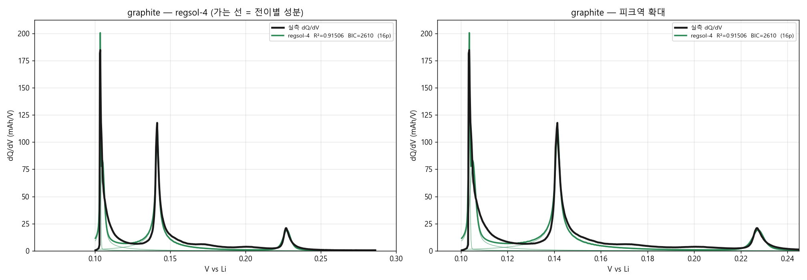
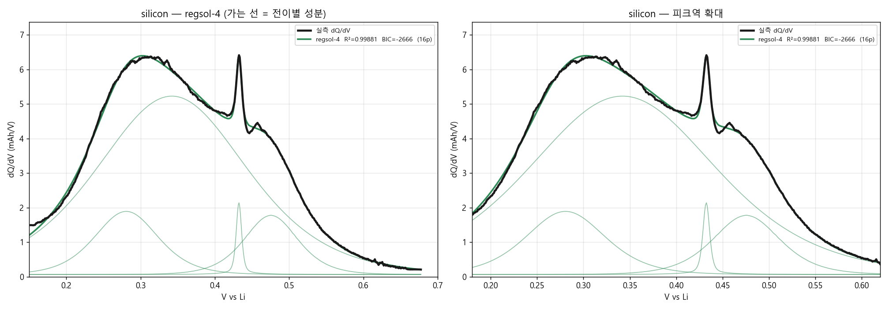
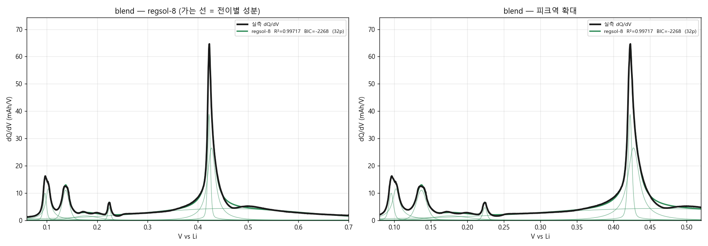
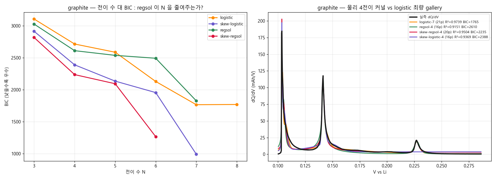

# v1.0.26A — regsol 판 (물리 전이 최소 구성)

> 정칙용액 두-상 커널로 흑연을 **물리 staging 4 전이**만으로 기술하려는 판. 질문 = 이 4 개가 gallery 7 개로의 분화를 스스로 모사하는가?
>
> 작성 2026-07-27 · 기준 코드 = v1.0.25.1 (`main`)

---

## 한 줄 요약

흑연을 regsol **4 전이**로 기술하면 R²=0.91506, BIC=2609.6 입니다. 같은 데이터에서 로지스틱 gallery 7 전이는 BIC 1765.1 이므로, **물리 4 전이는 gallery 7 전이를 대체하지 못합니다**(ΔBIC +844.5).

### 판정

- ❌ **regsol-4 는 gallery-7 을 대체하지 못한다.** 두-상 Maxwell 평탄이 "한 봉우리를 넓은 것+좁은 것으로 쪼개는" gallery 분화의 물리적 정체라는 가설은 이 데이터에서 성립하지 않는다.
- ❌ **regsol 자신도 분화를 필요로 한다.** regsol 을 N=4→7 로 올리면 BIC 가 개선되고 근축퇴쌍이 함께 늘어난다 — 분화를 흡수하는 것이 아니라 똑같이 겪는다.
- ⚠️ **regsol 의 우위는 전이 수가 부족할 때만 나타난다.** N=4·5 에서는 로지스틱을 이기지만 N=6 부터 역전된다. v1.0.25 의 "@3 이득은 전이 수 부족의 우회" 판정과 같은 구조다.
- ❌ **흑연에서 전하 보존이 깨진다.** 창 안 면적 결손 **+12.05%** — 급준 피크를 못 세워 과소적분한다. 다른 모든 피팅은 결손 ≤0.06% 다. 이것은 적합도 열세와 별개인 물리적 결함이다.
- ✅ **다만 Ω 값 자체는 문헌과 맞는다.** 흑연 4 전이의 Ω 가 전부 2RT 근방(marginal 두-상)에 모이며 이는 독립 앵커 Cordoba 2024 Ω_a≈2.5RT 와 정합한다. **"흑연이 두-상이다"는 참이고, "그래서 regsol 커널이 gallery 를 대체한다"는 거짓이다** — 두 명제를 분리해서 읽어야 한다.

---

## 데이터와 방법 (두 버전 공통 — 그래서 비교가 성립한다)

| 항목 | 내용 |
|---|---|
| 데이터 | SINTEF / EU IntelLiGent, Zenodo record **20086298**, 라이선스 **CC-BY-4.0** |
| 셀 | 반쪽셀 vs Li, pseudo-OCV **C/50**, 상온 · `gr.csv`(흑연) `si.csv`(실리콘) `sigr.csv`(블렌드) |
| dQ/dV | 사용자 BDD `99_Backend` 방식 이식 — **dMSMCD 다중창 중앙값 미분 + 웨이블릿 denoise + savgol 앙상블**, 이후 등장성회귀로 V(Q) 단조화 → 균일 V 격자 재빈닝 |
| 피팅 | `scipy.least_squares` (trf, bounded) · **3-시드전략 × 4-재시작** 동일 적용 |
| 지표 | R² · **BIC**(파라미터 수 보정) · 피크역/벨리역 RMSE · 면적 보존 |

> **★BIC 로 읽으십시오.** 두 버전은 파라미터 수가 다릅니다(흑연 기준 A 16p vs B 21p).
> R² 는 파라미터가 많은 쪽에 자동으로 유리하므로 단독 비교하면 안 됩니다.

### dQ/dV 계산에서 잡은 함정 (이 버전들에 반영됨)

1. **전압 양자화** — 원자료 V 가 1 µV 눈금이고 인접 ΔV 중앙값이 8 µV, 550 쌍은 ΔV=0 입니다.
   단일창 미분(`np.gradient`)으로 dV/dQ 를 구하면 0 나눗셈으로 dQ/dV 가 **10¹²** 까지 발산합니다.
   다중창 중앙값(dMSMCD)이 이를 흡수합니다.
2. **regsol 조성격자 ripple** — regsol 은 조성격자에 대한 합이라, broadening 폭 w 가 이웃
   격자점의 전압 간격보다 좁으면 곡선이 빗살(comb)로 깨집니다. 본 버전은 격자합 대신
   **혼화갭 닫힌형 + 고용체 밀도⊛합성곱(FFT)** 으로 계산해 격자 의존을 제거했습니다
   (v1.0.24 원본 `_REGSOL_XG=1200` 대비 꼬리 위글 **140배 감소**, 속도 55배).


---

## 결과

| 소재 | 커널 | 전이 N | 파라미터 | R² | BIC | 피크역 RMSE | 벨리역 RMSE | 면적 결손 |
|---|---|---:|---:|---:|---:|---:|---:|---:|
| 흑연 | `regsol` | 4 | 16p | 0.91506 | 2609.6 | 18.754 | 1.179 | +12.05% ⚠️ |
| 실리콘 | `regsol` | 4 | 16p | 0.99881 | -2665.7 | 0.071 | 0.136 | +0.01% |
| 흑연+Si 블렌드 | `regsol` | 8 | 32p | 0.99717 | -2267.9 | 0.521 | 0.267 | +0.01% |

> **면적 결손** = 1 − ∫모델 / ∫실측 (창 안). 전하 보존 지표이며 0 에 가까워야 한다.
>
> ⚠️ **흑연 에서 +12.05% 결손** — 모델이 창 안 전하의 12.1% 를 놓치고 있다. R²/BIC 열세와 별개인 **물리적 결함**이다(급준 피크를 못 세워 과소적분).


### 흑연



### 실리콘



### 흑연+Si 블렌드



---

## 전이 파라미터 (코드에 바로 넣을 수 있는 형태)

### 흑연 — `regsol` 4 전이

| # | U₀ [mV] | Ω [J/mol] | Ω/RT | 두-상? | x_binodal | Q [mAh] | w [mV] |
|---:|---:|---:|---:|:---:|---:|---:|---:|
| 1 | 103.62 | 6301 | 2.542 | **예** | 0.1355 | 0.1520 | 0.178 |
| 2 | 105.12 | 5035 | 2.031 | **예** | 0.3934 | 0.5154 | 0.696 |
| 3 | 141.42 | 4649 | 1.876 | 아니오 | 0.5000 | 0.8432 | 0.235 |
| 4 | 227.41 | 5697 | 2.298 | **예** | 0.2045 | 0.1718 | 1.559 |

→ 원본 JSON: [`params/params_graphite.json`](params/params_graphite.json)

### 실리콘 — `regsol` 4 전이

| # | U₀ [mV] | Ω [J/mol] | Ω/RT | 두-상? | x_binodal | Q [mAh] | w [mV] |
|---:|---:|---:|---:|:---:|---:|---:|---:|
| 1 | 280.70 | 19831 | 8.000 | **예** | 0.0003 | 0.2084 | 28.529 |
| 2 | 342.11 | 19785 | 7.982 | **예** | 0.0003 | 1.3900 | 67.330 |
| 3 | 432.38 | 6075 | 2.451 | **예** | 0.1568 | 0.0247 | 2.300 |
| 4 | 475.53 | 250 | 0.101 | 아니오 | 0.5000 | 0.1668 | 0.892 |

→ 원본 JSON: [`params/params_silicon.json`](params/params_silicon.json)

### 흑연+Si 블렌드 — `regsol` 8 전이

| # | U₀ [mV] | Ω [J/mol] | Ω/RT | 두-상? | x_binodal | Q [mAh] | w [mV] |
|---:|---:|---:|---:|:---:|---:|---:|---:|
| 1 | 96.03 | 7098 | 2.863 | **예** | 0.0850 | 0.0905 | 1.978 |
| 2 | 102.67 | 4009 | 1.617 | 아니오 | 0.5000 | 0.2500 | 0.939 |
| 3 | 137.40 | 19418 | 7.833 | **예** | 0.0004 | 0.2003 | 4.568 |
| 4 | 176.88 | 19831 | 8.000 | **예** | 0.0003 | 0.1006 | 16.188 |
| 5 | 224.16 | 19831 | 8.000 | **예** | 0.0003 | 0.0340 | 1.836 |
| 6 | 422.74 | 6544 | 2.640 | **예** | 0.1168 | 0.3201 | 1.677 |
| 7 | 427.49 | 3955 | 1.596 | 아니오 | 0.5000 | 0.7657 | 2.590 |
| 8 | 456.36 | 1 | 0.000 | 아니오 | 0.5000 | 1.8460 | 103.790 |

→ 원본 JSON: [`params/params_blend.json`](params/params_blend.json)


### ⚠️ Ω 경계 포화 경고

- **실리콘**: 2/4 전이의 Ω 가 탐색 경계에 붙었다 (U=281 mV → Ω/RT=8.00, U=342 mV → Ω/RT=7.98). → **이 Ω 는 식별된 값이 아니다**(경계 위 어떤 값이어도 같은 곡선). regsol 이 두-상 물리가 아니라 **near-delta 급준화 손잡이**로 쓰이고 있다는 신호이며, v1.0.24 가 @1 로 이미 기각한 거동이다.
- **흑연+Si 블렌드**: 3/8 전이의 Ω 가 탐색 경계에 붙었다 (U=177 mV → Ω/RT=8.00, U=224 mV → Ω/RT=8.00, U=456 mV → Ω/RT=0.00). → **이 Ω 는 식별된 값이 아니다**(경계 위 어떤 값이어도 같은 곡선). regsol 이 두-상 물리가 아니라 **near-delta 급준화 손잡이**로 쓰이고 있다는 신호이며, v1.0.24 가 @1 로 이미 기각한 거동이다.

경계에 붙지 않은 전이의 Ω 만 물리량으로 읽으십시오.


### ✅ 문헌 앵커와의 일치 (버전 A 의 유일한 실질 성과)

흑연 4 전이의 Ω/RT = **2.54, 2.03, 1.88, 2.30** — 전부 **2RT 근방**(marginal 두-상)에 모입니다. 이는 독립 문헌 앵커 **Cordoba 2024 의 Ω_a ≈ 2.5 RT**(평균장 정칙용액, 흑연 Ω 의 유일한 실수치 앵커)와 정합합니다.

> 즉 **적합도로는 지지만 Ω 값 자체는 물리를 말합니다.** 흑연이 marginal 두-상이라는 것은 데이터가 독립적으로 답한 것이며, 이 사실과 "regsol 커널이 gallery 를 대체하느냐"는 **별개 문제**입니다. 전자는 참, 후자는 거짓입니다.

---

## 두 버전 head-to-head (흑연, 같은 데이터·같은 절차)

### 전이 수 대 BIC 전면 스윕

| N | logistic | skew-logistic | regsol | skew-regsol |
|---:|---:|---:|---:|---:|
| 3 | 3105 | 2913 | 3026 | 2816 |
| 4 | 2714 | 2388 | 2610 | 2235 |
| 5 | 2585 | 2134 | 2536 | 2093 |
| 6 | 2128 | 1954 | 2491 | 1265 |
| 7 | 1765 | 992 | 1825 | — |
| 8 | 1768 | — | — | — |



### 핵심 대조

| 모델 | 파라미터 | R² | BIC | logistic-7 대비 ΔBIC | 근축퇴쌍 |
|---|---:|---:|---:|---:|---:|
| `logistic`-7 | 21p | 0.97389 | 1765.1 | +0.0 ← 기준 | 6 |
| `logistic`-4 | 12p | 0.89879 | 2713.6 | +948.5 | 1 |
| `regsol`-4 | 16p | 0.91506 | 2609.6 | +844.5 | 1 |
| `regsol`-7 | 28p | 0.97339 | 1825.3 | +60.2 | 4 |
| `skew-logistic`-4 | 16p | 0.93691 | 2388.3 | +623.2 | 1 |
| `skew-logistic`-7 | 28p | 0.99133 | 991.5 | -773.6 | 4 |
| `skew-regsol`-4 | 20p | 0.95044 | 2235.3 | +470.2 | 1 |
| `skew-regsol`-6 | 30p | 0.98769 | 1264.9 | -500.2 | 4 |

## 정직한 한계 (반드시 같이 읽을 것)

1. **데이터가 평형이 아닙니다.** 본 버전들이 쓴 `gr.csv`/`si.csv`/`sigr.csv` 는 Zenodo 20086298 의
   4 프로토콜 중 **plain pseudo-OCV(C/50)** 로, 가장 비평형입니다. v1.0.25 addendum 실측:
   같은 모델이 p-OCV **0.977** vs p-OCV+hold **0.9945**(피크역 RMSE 4.708→2.701).
   → 잔차의 상당분이 모델 결함이 아니라 **데이터의 비평형 잔여**입니다.
   **GITT / p-OCV+hold 평형 데이터로 재검이 남아 있습니다**(`dl_sintef.ps1` 미실행).
2. **흑연 0.104 V 피크는 계측 분해 한계에 걸려 있습니다.** 원자료에서 이 평탄은
   V 폭 약 0.6 mV 안에 2,400 점·0.29 mAh 가 몰려 있어 FWHM ≲ 1 mV — RT/F(25.7 mV)의 **1/25** 입니다.
   대칭 로지스틱이 이를 맞추려면 w 를 0.4 mV 까지 내려야 하는데 고용체로는 나올 수 없는 폭입니다.
   두-상이면 자연스럽지만, **비평형 인공물일 가능성이 배제되지 않았습니다** — 평형 데이터로만 갈립니다.
3. **전이 수는 상(phase) 수가 아닙니다.** v1.0.25 가 확정한 대로 gallery 세분은 곡선 표현
   해상도이며 XRD 상 수(흑연 4 staging)를 바꾸지 않습니다. **봉우리 수를 상 수의 증거로 쓰지 마십시오.**
4. **파라미터는 seed 이지 신뢰값이 아닙니다.** 단일 셀·단일 온도·단일 율속 피팅 결과이며
   불확실도 구간을 산출하지 않았습니다(bootstrap 미수행).


---

## 재현

```bash
cd Claude/results/comp_v26_data
python -X utf8 build_two_versions.py     # 두 버전 피팅 → out_versions/
python -X utf8 make_version_docs.py      # 본 문서 재생성
```

필요 패키지: `numpy` `scipy` `pandas` `matplotlib` `PyWavelets`.
커널 구현 = `regsol_kernel.py`(regsol/skew-regsol) · `test_skew_regsol_v2.py`(logistic 계열) ·
`bdd_dqdv.py`(BDD dQ/dV). 원자료 = `Claude/results/comp_v24/sintef_data/`.


---

## 관련 문서

- 반대편 버전: [v1.0.26B-gallery](../v1.0.26B-gallery/README.md)
- 기준 버전: [v1.0.25.1](../v1.0.25.1/results/HANDOVER_v25.md)
- v1.0.25 데이터 정직화 addendum: [`V1025_DATA_ADDENDUM.md`](../v1.0.25.1/results/V1025_DATA_ADDENDUM.md)
