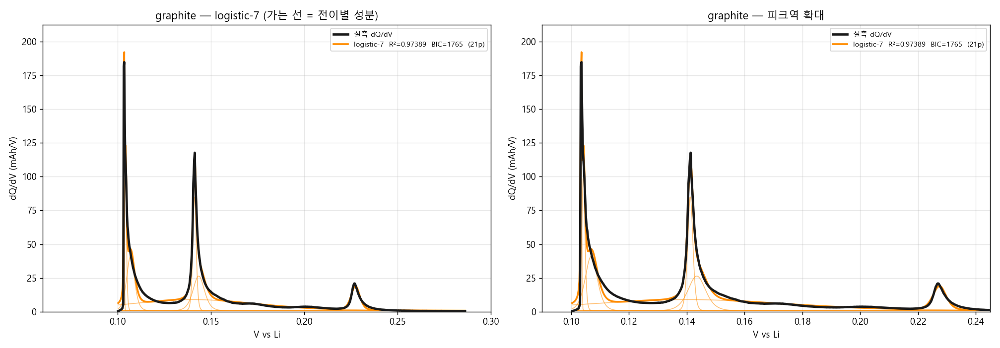
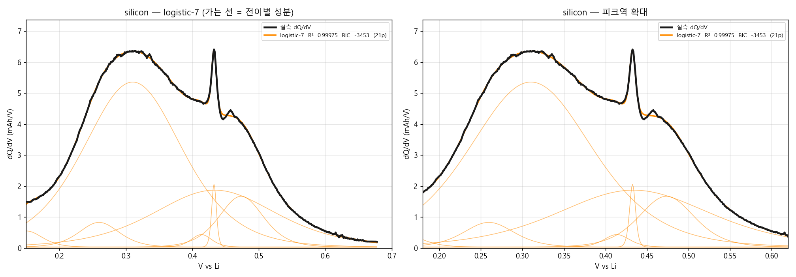
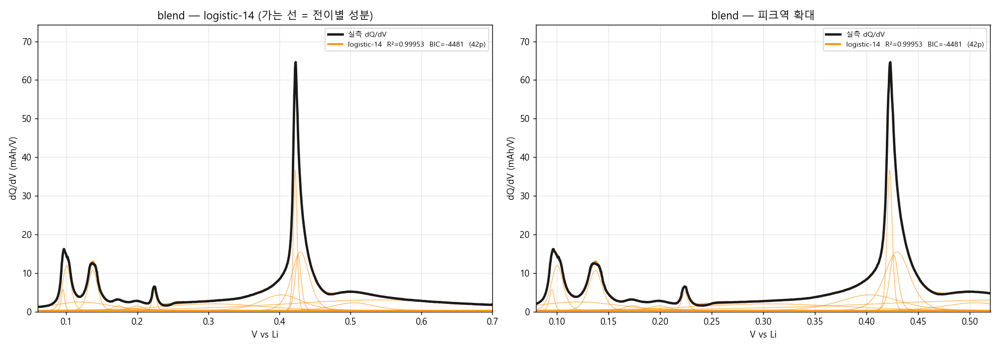

# v1.0.26B — gallery 판 (로지스틱 흑연 7 + 실리콘 7)

> 경험적 MSMR gallery 구성. 흑연 7 · 실리콘 7 = **14 전이**를 대칭 로지스틱으로 기술한다.
>
> 작성 2026-07-27 · 기준 코드 = v1.0.25.1 (`main`)

---

## 한 줄 요약

흑연 로지스틱 **7 전이**가 R²=0.97389, BIC=1765.1 로 regsol 4 전이(BIC 2609.6)를 크게 앞섭니다(ΔBIC +844.5). 다만 늘어난 전이의 정체는 새 봉우리가 아니라 **같은 전압에 폭만 다른 쌍**입니다.

### 판정

- ✅ **적합도는 이쪽이 이긴다.** 파라미터 수를 보정한 BIC 기준으로도 gallery-7 이 우세하다.
- ⚠️ **늘어난 전이는 물리 상이 아니다.** N 을 4→7 로 올릴 때 검출 피크는 3 개 그대로인데 근축퇴쌍(같은 U ±5 mV·폭비 >2)이 1→6 개로 늘어난다. 즉 gallery 는 한 봉우리를 "넓은 것 + 좁은 것"으로 쪼개고 있다. **XRD 상 수(흑연 4 staging)는 불변이다.**
- ⚠️ **N=8 은 과적합이다.** BIC 가 N=7 에서 최소이고 N=8 에서 도로 올라간다(포화).
- 📌 **더 나은 선택지가 있다.** 같은 스윕에서 `skew-logistic`-7 이 BIC 991.5 로 본 판(logistic-7)보다 크게 우수하다 — 비대칭 α 가 전이 수보다 큰 단일 효과다.

---

## 데이터와 방법 (두 버전 공통 — 그래서 비교가 성립한다)

| 항목 | 내용 |
|---|---|
| 데이터 | SINTEF / EU IntelLiGent, Zenodo record **20086298**, 라이선스 **CC-BY-4.0** |
| 셀 | 반쪽셀 vs Li, pseudo-OCV **C/50**, 상온 · `gr.csv`(흑연) `si.csv`(실리콘) `sigr.csv`(블렌드) |
| dQ/dV | 사용자 BDD `99_Backend` 방식 이식 — **dMSMCD 다중창 중앙값 미분 + 웨이블릿 denoise + savgol 앙상블**, 이후 등장성회귀로 V(Q) 단조화 → 균일 V 격자 재빈닝 |
| 피팅 | `scipy.least_squares` (trf, bounded) · **3-시드전략 × 4-재시작** 동일 적용 |
| 지표 | R² · **BIC**(파라미터 수 보정) · 피크역/벨리역 RMSE · 면적 보존 |

> **★BIC 로 읽으십시오.** 두 버전은 파라미터 수가 다릅니다(흑연 기준 A 16p vs B 21p).
> R² 는 파라미터가 많은 쪽에 자동으로 유리하므로 단독 비교하면 안 됩니다.

### dQ/dV 계산에서 잡은 함정 (이 버전들에 반영됨)

1. **전압 양자화** — 원자료 V 가 1 µV 눈금이고 인접 ΔV 중앙값이 8 µV, 550 쌍은 ΔV=0 입니다.
   단일창 미분(`np.gradient`)으로 dV/dQ 를 구하면 0 나눗셈으로 dQ/dV 가 **10¹²** 까지 발산합니다.
   다중창 중앙값(dMSMCD)이 이를 흡수합니다.
2. **regsol 조성격자 ripple** — regsol 은 조성격자에 대한 합이라, broadening 폭 w 가 이웃
   격자점의 전압 간격보다 좁으면 곡선이 빗살(comb)로 깨집니다. 본 버전은 격자합 대신
   **혼화갭 닫힌형 + 고용체 밀도⊛합성곱(FFT)** 으로 계산해 격자 의존을 제거했습니다
   (v1.0.24 원본 `_REGSOL_XG=1200` 대비 꼬리 위글 **140배 감소**, 속도 55배).


---

## 결과

| 소재 | 커널 | 전이 N | 파라미터 | R² | BIC | 피크역 RMSE | 벨리역 RMSE | 면적 결손 |
|---|---|---:|---:|---:|---:|---:|---:|---:|
| 흑연 | `logistic` | 7 | 21p | 0.97389 | 1765.1 | 11.304 | 1.375 | +0.06% |
| 실리콘 | `logistic` | 7 | 21p | 0.99975 | -3453.0 | 0.074 | 0.076 | +0.00% |
| 흑연+Si 블렌드 | `logistic` | 14 | 42p | 0.99953 | -4480.8 | 0.443 | 0.18 | +0.00% |

> **면적 결손** = 1 − ∫모델 / ∫실측 (창 안). 전하 보존 지표이며 0 에 가까워야 한다.


### 흑연



### 실리콘



### 흑연+Si 블렌드



---

## 전이 파라미터 (코드에 바로 넣을 수 있는 형태)

### 흑연 — `logistic` 7 전이

| # | U [mV] | w [mV] | w/(RT/F) | Q [mAh] |
|---:|---:|---:|---:|---:|
| 1 | 103.50 | 0.100 | 0.004 | 0.0727 |
| 2 | 104.26 | 0.360 | 0.014 | 0.1456 |
| 3 | 107.00 | 1.400 | 0.054 | 0.2258 |
| 4 | 140.19 | 23.184 | 0.902 | 0.7626 |
| 5 | 141.26 | 0.593 | 0.023 | 0.2014 |
| 6 | 143.50 | 2.021 | 0.079 | 0.2074 |
| 7 | 227.41 | 1.513 | 0.059 | 0.1070 |

→ 원본 JSON: [`params/params_graphite.json`](params/params_graphite.json)

### 실리콘 — `logistic` 7 전이

| # | U [mV] | w [mV] | w/(RT/F) | Q [mAh] |
|---:|---:|---:|---:|---:|
| 1 | 150.50 | 15.915 | 0.619 | 0.0331 |
| 2 | 259.57 | 20.281 | 0.789 | 0.0647 |
| 3 | 310.18 | 49.639 | 1.932 | 1.0580 |
| 4 | 413.58 | 10.324 | 0.402 | 0.0167 |
| 5 | 432.55 | 2.408 | 0.094 | 0.0195 |
| 6 | 433.66 | 61.527 | 2.395 | 0.4525 |
| 7 | 473.42 | 22.334 | 0.869 | 0.1467 |

→ 원본 JSON: [`params/params_silicon.json`](params/params_silicon.json)

### 흑연+Si 블렌드 — `logistic` 14 전이

| # | U [mV] | w [mV] | w/(RT/F) | Q [mAh] |
|---:|---:|---:|---:|---:|
| 1 | 95.42 | 1.495 | 0.058 | 0.0329 |
| 2 | 100.61 | 3.864 | 0.150 | 0.1799 |
| 3 | 120.48 | 26.984 | 1.050 | 0.2384 |
| 4 | 137.51 | 4.462 | 0.174 | 0.1852 |
| 5 | 173.53 | 5.450 | 0.212 | 0.0267 |
| 6 | 199.72 | 6.057 | 0.236 | 0.0290 |
| 7 | 224.16 | 1.991 | 0.077 | 0.0383 |
| 8 | 306.16 | 47.080 | 1.832 | 0.3233 |
| 9 | 403.31 | 19.327 | 0.752 | 0.3130 |
| 10 | 422.52 | 1.650 | 0.064 | 0.2408 |
| 11 | 426.58 | 2.790 | 0.109 | 0.1598 |
| 12 | 429.76 | 8.274 | 0.322 | 0.5024 |
| 13 | 505.07 | 19.169 | 0.746 | 0.1527 |
| 14 | 538.78 | 90.809 | 3.534 | 0.9896 |

→ 원본 JSON: [`params/params_blend.json`](params/params_blend.json)

---

## 두 버전 head-to-head (흑연, 같은 데이터·같은 절차)

### 전이 수 대 BIC 전면 스윕

| N | logistic | skew-logistic | regsol | skew-regsol |
|---:|---:|---:|---:|---:|
| 3 | 3105 | 2913 | 3026 | 2816 |
| 4 | 2714 | 2388 | 2610 | 2235 |
| 5 | 2585 | 2134 | 2536 | 2093 |
| 6 | 2128 | 1954 | 2491 | 1265 |
| 7 | 1765 | 992 | 1825 | — |
| 8 | 1768 | — | — | — |


### 핵심 대조

| 모델 | 파라미터 | R² | BIC | logistic-7 대비 ΔBIC | 근축퇴쌍 |
|---|---:|---:|---:|---:|---:|
| `logistic`-7 | 21p | 0.97389 | 1765.1 | +0.0 ← 기준 | 6 |
| `logistic`-4 | 12p | 0.89879 | 2713.6 | +948.5 | 1 |
| `regsol`-4 | 16p | 0.91506 | 2609.6 | +844.5 | 1 |
| `regsol`-7 | 28p | 0.97339 | 1825.3 | +60.2 | 4 |
| `skew-logistic`-4 | 16p | 0.93691 | 2388.3 | +623.2 | 1 |
| `skew-logistic`-7 | 28p | 0.99133 | 991.5 | -773.6 | 4 |
| `skew-regsol`-4 | 20p | 0.95044 | 2235.3 | +470.2 | 1 |
| `skew-regsol`-6 | 30p | 0.98769 | 1264.9 | -500.2 | 4 |

## 정직한 한계 (반드시 같이 읽을 것)

1. **데이터가 평형이 아닙니다.** 본 버전들이 쓴 `gr.csv`/`si.csv`/`sigr.csv` 는 Zenodo 20086298 의
   4 프로토콜 중 **plain pseudo-OCV(C/50)** 로, 가장 비평형입니다. v1.0.25 addendum 실측:
   같은 모델이 p-OCV **0.977** vs p-OCV+hold **0.9945**(피크역 RMSE 4.708→2.701).
   → 잔차의 상당분이 모델 결함이 아니라 **데이터의 비평형 잔여**입니다.
   **GITT / p-OCV+hold 평형 데이터로 재검이 남아 있습니다**(`dl_sintef.ps1` 미실행).
2. **흑연 0.104 V 피크는 계측 분해 한계에 걸려 있습니다.** 원자료에서 이 평탄은
   V 폭 약 0.6 mV 안에 2,400 점·0.29 mAh 가 몰려 있어 FWHM ≲ 1 mV — RT/F(25.7 mV)의 **1/25** 입니다.
   대칭 로지스틱이 이를 맞추려면 w 를 0.4 mV 까지 내려야 하는데 고용체로는 나올 수 없는 폭입니다.
   두-상이면 자연스럽지만, **비평형 인공물일 가능성이 배제되지 않았습니다** — 평형 데이터로만 갈립니다.
3. **전이 수는 상(phase) 수가 아닙니다.** v1.0.25 가 확정한 대로 gallery 세분은 곡선 표현
   해상도이며 XRD 상 수(흑연 4 staging)를 바꾸지 않습니다. **봉우리 수를 상 수의 증거로 쓰지 마십시오.**
4. **파라미터는 seed 이지 신뢰값이 아닙니다.** 단일 셀·단일 온도·단일 율속 피팅 결과이며
   불확실도 구간을 산출하지 않았습니다(bootstrap 미수행).


---

## 재현

```bash
cd Claude/results/comp_v26_data
python -X utf8 build_two_versions.py     # 두 버전 피팅 → out_versions/
python -X utf8 make_version_docs.py      # 본 문서 재생성
```

필요 패키지: `numpy` `scipy` `pandas` `matplotlib` `PyWavelets`.
커널 구현 = `regsol_kernel.py`(regsol/skew-regsol) · `test_skew_regsol_v2.py`(logistic 계열) ·
`bdd_dqdv.py`(BDD dQ/dV). 원자료 = `Claude/results/comp_v24/sintef_data/`.


---

## 관련 문서

- 반대편 버전: [v1.0.26A-regsol](../v1.0.26A-regsol/README.md)
- 기준 버전: [v1.0.25.1](../v1.0.25.1/results/HANDOVER_v25.md)
- v1.0.25 데이터 정직화 addendum: [`V1025_DATA_ADDENDUM.md`](../v1.0.25.1/results/V1025_DATA_ADDENDUM.md)
