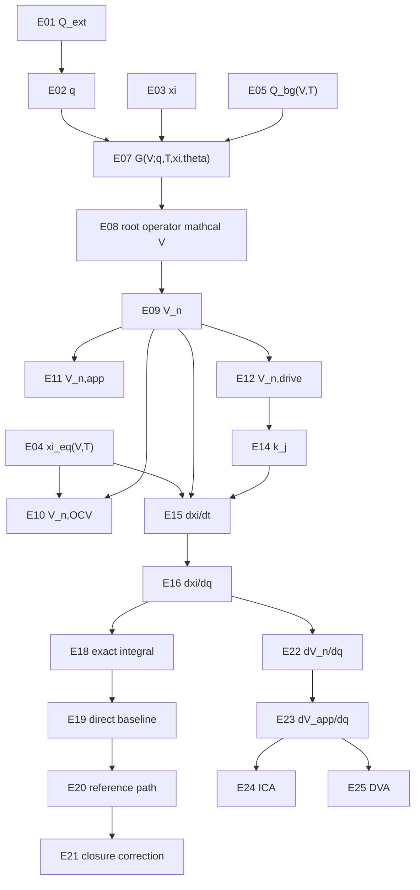

# Rebuild v2 Equation Dependency DAG

Project: `D:\Projects\Project_Anode_Fit`

Plan: `D:\Projects\Project_Anode_Fit\Codex\plans\2026-05-27-graphite-ica-from-scratch-rebuild-plan-v2-canonical.md`

Phase: `Phase 005 - Notation And Equation Dependency Contract`

Created: 2026-05-27

## Purpose

This document fixes the equation order for the blank rewrite. It prevents any equation from using `V_n` before the charge-balance root operator has been defined.

## Dependency Table

| Eq ID | Equation Role | Schematic Formula | Prerequisites | Outputs | Manuscript Location |
|---|---|---|---|---|---|
| E01 | external charge | `Q_ext(t)=int I_abs(t') dt'` or signed equivalent | `t`, `I(t)`, sign convention | `Q_ext` | Chapter 1 section 2 |
| E02 | normalized charge | `q=Q_ext/Q_cell` | E01, `Q_cell` | `q` | Chapter 1 section 2 |
| E03 | internal state declaration | `xi=(xi_1,...,xi_Np)` | transition index set | `xi_j` | Chapter 1 section 4 |
| E04 | equilibrium occupancy with dummy voltage | `xi_{j,eq}(V,T)=f_j(V,T;U_j,w_j,s_xi)` | dummy `V`, `T`, `U_j`, `w_j`, `s_xi,j` | `xi_{j,eq}` | Chapter 1 section 4 |
| E05 | background storage | `Q_bg=Q_bg(V,T;theta)` | dummy `V`, `T`, storage model | `Q_bg` | Chapter 1 section 3 |
| E06 | transition capacity scaling | `a_j=Q_{j,tot}/Q_cell` | `Q_{j,tot}`, `Q_cell` | `a_j` | Chapter 1 section 3 or notation table |
| E07 | charge-balance residual | `G(V;q,T,xi,theta)=Q_bg(V,T)+sum Q_{j,tot} xi_j-Q_cell q` | E02, E03, E05, transition capacities | `G` | Chapter 1 section 5 |
| E08 | root operator | `mathcal V(q,T,xi;theta): G(mathcal V;q,T,xi,theta)=0` | E07, admissible voltage interval | `mathcal V` | Chapter 1 section 5 |
| E09 | solved internal potential | `V_n=mathcal V(q,T,xi;theta)` | E08 | `V_n` | Chapter 1 section 5 |
| E10 | equilibrium OCV special root | solve `Q_cell q=Q_bg(V,T)+sum Q_{j,tot} xi_{j,eq}(V,T)` | E04, E05, E07-E09 with equilibrium state | `V_{n,OCV}` | Chapter 1 section 6 |
| E11 | apparent voltage | `V_{n,app}=V_n+s_I I_abs R_n(q,T,I_abs)` or declared alternative | E01, E02, E09, `R_n`, `s_I` | `V_{n,app}` | Chapter 1 section 7 |
| E12 | driving voltage | `V_{n,drive}=declared function of V_n, V_app, I, T` | E09, optionally E11 | `V_{n,drive}` | Chapter 1 section 7 / Chapter 3 interface |
| E13 | affinity | `A_j=s_{phi,j} F (V_{n,drive}-U_j(T))` if electrochemical form is used | E12, `U_j`, signs, `F` | `A_j` | Chapter 1 section 7 / Chapter 3 interface |
| E14 | kinetic rate | `k_j=k_j(V_n,q,T,I;theta)` or model-specific extension | E09, E02, `T`, `I`, parameters | `k_j` | Chapter 1 section 8 / Chapter 3 interface |
| E15 | time-domain dynamics | `dxi_j/dt=k_j [xi_{j,eq}(V_n,T)-xi_j]` | E04, E09, E14 | `dxi_j/dt` | Chapter 1 section 8 |
| E16 | charge-domain dynamics | `dxi_j/dq=(Q_cell/I_abs) k_j [xi_{j,eq}(V_n,T)-xi_j]` | E01-E02, E04, E09, E14-E15, `I_abs>0` | `dxi_j/dq` | Chapter 1 section 8 |
| E17 | rest relaxation | `dq/dt=0`, solve time-domain `dxi_j/dt` at fixed `q` | E02, E09, E15 | rest-state relaxation | Chapter 1 section 8 |
| E18 | exact integral form | `xi_j(q)=xi_j(q0)+int_{q0}^{q} RHS_j(s, V_n(s), xi_j(s)) ds` | E16 and root-solved `V_n(s)` | Volterra-like formulation | Chapter 1 section 9 |
| E19 | direct root-solve integration baseline | at each step, solve E07-E09, then update E15/E16 | E07-E18 | exact numerical baseline | Chapter 1 section 9 / Appendix C |
| E20 | reference path | `xi_j^ref(q)` and `V_n^ref(q)=mathcal V(q,T,xi^ref;theta)` | E08-E10 or chosen direct solution | reference trajectory | Chapter 1 section 10 |
| E21 | closure correction | `xi_j=xi_j(q0)+int reference_integrand * C_j ds` | E18-E20 | approximate closure | Chapter 1 section 10 / Appendix D |
| E22 | implicit derivative for `V_n` | `dV_n/dq=(Q_cell-sum Q_j,tot dxi_j/dq)/(partial Q_bg/partial V)` in isothermal simplified form | E05, E07-E09, E16 | `dV_n/dq` | Chapter 1 section 11 |
| E23 | apparent-voltage derivative | `dV_app/dq=dV_n/dq+s_I d(I_abs R_n)/dq` | E11, E22 | `dV_app/dq` | Chapter 1 section 11 |
| E24 | ICA observable | `dQ_ext/dV_app=Q_cell/(dV_app/dq)` | E02, E23 | ICA | Chapter 1 section 11 |
| E25 | DVA observable | `dV_app/dQ_ext=(1/Q_cell)(dV_app/dq)` | E02, E23 | DVA | Chapter 1 section 11 |
| E26 | validation residual | `G(V_n;q,T,xi,theta)/Q_cell` and related checks | E07-E25 as applicable | validation metrics | Chapter 1 section 12 / Chapter 4 |

## Graph View

## Forbidden Reordering

| Forbidden Move | Why It Is Forbidden | Replacement |
|---|---|---|
| Define `V_n` before E07-E08 | Recreates the old prescribed-potential logic | Define dummy `V`, then `G`, then `mathcal V`, then `V_n`. |
| Use `V_n` inside `k_j` before E09 | Kinetics would depend on an undefined variable | Define rate only after root-solved `V_n`. |
| Treat `V_{n,OCV}(q,T)` as input before E10 | OCV must be the equilibrium special root | Place OCV after charge balance. |
| Differentiate charge balance before `dxi_j/dq` exists | `dV_n/dq` depends on state derivatives | Define dynamics first, derivative observables later. |
| Introduce refs. 6/7 closure before E18-E19 | Closure must approximate a known exact problem | Present direct Volterra/root-solve baseline first. |
| Let Chapter 2 heat redefine `T` inside Chapter 1 equations without declaring coupling | Breaks chapter dependency contract | Treat `T` as input in Chapter 1; add coupling only in Chapter 2. |

## Symbol Collision Section

| Symbol | Collision Risk | DAG Control |
|---|---|---|
| `w_j` | capacity weight vs voltage width | E04 uses `w_j` only as voltage width; E06 uses `a_j` for capacity fraction. |
| `V` vs `V_n` | dummy argument vs solved internal potential | E04-E07 may use dummy `V`; E09 introduces `V_n`. |
| `V_n` vs `V_{n,app}` vs `V_{n,drive}` | internal potential, observed apparent voltage, kinetic driving voltage | E09, E11, E12 separate them. |
| `Q_ext` vs storage terms | measured external charge vs internal storage | E01-E02 define measurement; E07 balances storage against it. |
| `F` | Faraday constant vs generic integrand | E13 reserves `F`; closure integrand should avoid `F` if ambiguity arises. |
| `R_n` vs kinetic prefactors | both can absorb voltage shift | E11 and E14 must be constrained later in Phase 009. |

## Allowed Synonyms

| DAG Term | Allowed Manuscript Term | Notes |
|---|---|---|
| exact direct solution | direct root-solve integration, direct DAE/Volterra solve | Use before approximate closure. |
| reference closure | reference-correction closure, ratio/correction closure | Do not call it a physical import from refs. 6/7. |
| internal potential | root-solved graphite potential | Must point to E09. |
| apparent voltage | observable apparent anode voltage | Must point to E11. |
| driving voltage | kinetic driving voltage | Must point to E12. |

## Gate Status

Gate: `PASS_REBUILD_V2_NOTATION_DEPENDENCY`

The DAG passes if every equation using `V_n` lists E08-E09 as prerequisites and no observable or closure equation is placed before the exact formulation.
