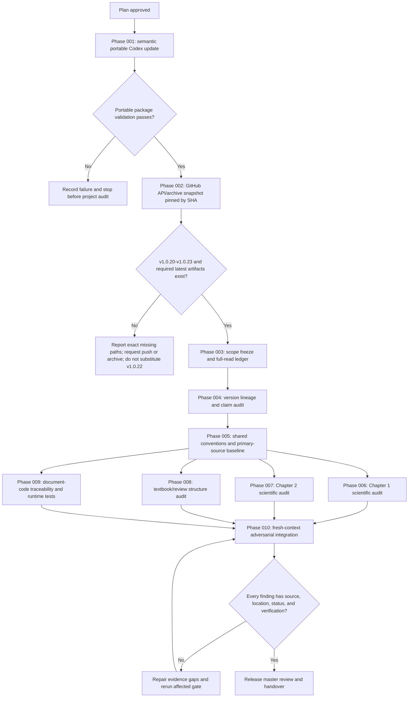

# Project_Anode_Fit v1.0.10-v1.0.23 Claude Work Product Audit Master Plan

> **For agentic workers:** REQUIRED SUB-SKILL: Use `superpowers:subagent-driven-development` for phase-scoped parallel review and `superpowers:verification-before-completion` before every phase gate. This plan is an audit and evidence plan, not authorization to modify the reviewed documents or their Git history.

**Goal:** Update the portable Codex operating package from the newer Claude operating lessons without regressing Codex-specific runtime capabilities, then independently audit the full v1.0.10-v1.0.23 document lineage, the latest Chapter 1/2 physics and chemistry, textbook/review-paper structure, and document-to-code fidelity.

**Architecture:** Work is evidence-first and phase-gated. A read-only GitHub snapshot is pinned by commit SHA under `D:\Projects\Project_Anode_Fit\Codex`, every in-scope source is tracked in a full-read ledger, scientific claims are tested against equations, primary literature, and executable numerical checks, and a fresh-context adversarial review challenges the integrated findings before release.

**Tech Stack:** Markdown/JSON/CSV evidence ledgers, GitHub read APIs and archive download only, PowerShell, Python, AST/static analysis, NumPy/SciPy where already required by the project, XeLaTeX/PDF rendering, primary literature and official bibliographic sources.

---

## Summary

This plan answers four user questions and one prerequisite task.

1. Update `D:\Projects\Project_skills\portable_codex_config` from the newer operating lessons in `D:\Projects\Project_skills\portable_claude_config` before beginning the scientific audit.
2. Reconstruct the work history and actual outcomes from v1.0.10 through v1.0.23, concentrating on `Claude\plans`, `Claude\results`, version-local plans/results, handovers, change logs, ledgers, and final `Claude\docs\<version>` artifacts.
3. Identify physical, chemical, mathematical, and inferential defects or improvement opportunities in the latest Chapter 1 and Chapter 2 documents.
4. Judge whether the latest organization and prose genuinely approach a self-contained textbook and a review article, rather than only adopting their surface register.
5. Verify whether Chapter 1 and Chapter 2 equations, conventions, assumptions, and examples were faithfully converted into code, and identify concrete gaps.

The audit is read-only with respect to `D:\Projects\Project_Anode_Fit\Claude`, all reviewed version directories, and all Git state. Audit artifacts and test harnesses are written only under `D:\Projects\Project_Anode_Fit\Codex`. The portable Codex package is the only external target authorized for content updates in this plan.

## Current Ground Truth

### Directly confirmed on 2026-07-19

- Active project: `D:\Projects\Project_Anode_Fit`.
- Codex work boundary: `D:\Projects\Project_Anode_Fit\Codex`.
- Local `Claude\docs` contains `v1.0.10` through `v1.0.19`; it does not contain v1.0.20-v1.0.23.
- The connected repository is `lksz1412/Project_Anode_Fit`; default branch is `main`.
- The likely active remote work branch is `claude/anode-fit-v1-0-20-cxshf9`.
- Read-only comparison reports that branch is 190 commits ahead of `main` and zero commits behind at the time of inspection.
- The branch exposes v1.0.20 and v1.0.21 artifacts. Its current `Claude/docs/INDEX.md` reports v1.0.22 as work in progress.
- `Claude/docs/v1.0.22/HANDOVER_v1.0.22.md` and `Claude/docs/v1.0.23/HANDOVER_v1.0.23.md` were not found at the inspected ref.
- Therefore v1.0.23 is a required but currently unverified audit input. The execution must not silently relabel v1.0.22 as v1.0.23 or as the user-intended latest state.
- Previous Codex work through the old Phase 043 lineage has been moved to `Codex\\old\\2026-07-19-pre-v1010-v1023-audit-reset`. This audit is a new workstream and starts at Phase 001 and Step 1.
- The portable Claude package has 56 files and is centered on Claude-specific `continuous-learning-v2`, Bash hooks, a global `CLAUDE.md`, and 30 detailed memory topics.
- The portable Codex package has 61 files and already contains the more capable Codex-specific `harness-core-v4`, PowerShell/Bash runtime parity, project templates, memory projections, manifests, sanitization tests, and approval-gated promotion.
- Portable update must therefore be a semantic port. Blind file copying or replacing harness-core with Claude's continuous-learning runtime is prohibited.

### Preliminary evidence only, not yet a final audit conclusion

- v1.0.19 records claim a Fable -> ten-reviewer -> Fable workflow, zero core physics defects after correction, asset preservation, and document/code alignment. These are claims to be independently tested, not accepted facts.
- v1.0.20 records claim a quality-correction release with bibliography verification, self-contained derivations, and matched code.
- v1.0.21 records claim expansion through grand-canonical charge balance, transition-state theory, worked examples, navigation variants, LCO examples, and an Si roadmap.
- The visible v1.0.22 index claims reorganization into material-specific chapters and continuing R6-R9 work. It is not yet a closed handover at the inspected ref.

## Phase Range

| Phase | Name | Steps | Primary output | Gate |
|---|---|---:|---|---|
| 001 | Portable Codex semantic update | 1-10 | Config delta matrix, updated package, validation result | `PORTABLE_CONFIG_PASS` |
| 002 | Read-only remote snapshot intake | 11-19 | SHA-pinned Claude snapshot and manifest | `V1023_SNAPSHOT_PASS` |
| 003 | Scope freeze and full-read ledger | 20-30 | Complete file inventory and read-coverage ledger | `SCOPE_AND_COVERAGE_PASS` |
| 004 | v1.0.10-v1.0.23 lineage reconstruction | 31-41 | Version/claim/change lineage audit | `LINEAGE_PASS` |
| 005 | Scientific convention and source baseline | 42-55 | Shared notation, sign, unit, assumption, and literature registry | `SCIENTIFIC_BASELINE_PASS` |
| 006 | Latest Chapter 1 physics/chemistry audit | 56-69 | Chapter 1 defect and improvement report | `CH1_AUDIT_PASS` |
| 007 | Latest Chapter 2 physics/chemistry audit | 70-81 | Chapter 2 defect and improvement report | `CH2_AUDIT_PASS` |
| 008 | Textbook/review structure audit | 82-98 | Genre, structure, pedagogy, and citation report | `STRUCTURE_AUDIT_PASS` |
| 009 | Document-to-code fidelity audit | 99-112 | Equation-code traceability matrix and numerical evidence | `DOC_CODE_AUDIT_PASS` |
| 010 | Adversarial integration and final handover | 113-122 | Master review, defect ledger, prioritized direction | `MASTER_REVIEW_PASS` |

## Workflow



## Non-goals and Scope Guards

- Do not run `git clone`, `git pull`, `git fetch`, `git checkout`, `git switch`, `git worktree`, `git add`, `git commit`, `git push`, `git merge`, or any other Git command in either project.
- Do not modify any branch, ref, commit, pull request, issue, or remote file.
- Do not modify anything under `D:\Projects\Project_Anode_Fit\Claude`.
- Do not modify any reviewed `Claude\docs\v1.0.10`-`v1.0.23` document, code file, PDF, plan, result, ledger, or handover.
- Do not treat successful LaTeX compilation, import, or regression tests as proof of physical correctness.
- Do not accept prior statements such as "physics defect 0", "bit-exact", "asset loss 0", or "self-contained" without reproducing the underlying evidence.
- Do not expand the main scientific review to Chapter 3 or later chapters except where they reveal a Chapter 1/2 boundary, duplicated assumption, or broken handoff.
- Do not implement proposed scientific or code repairs in this audit cycle. Report exact improvement directions and candidate changes; wait for a separate implementation request.
- Do not copy Claude's `continuous-learning-v2` runtime into Codex or replace `harness-core-v4`.
- Do not write Codex global configuration, install MCP, mutate Superpowers, or promote project memory globally.
- Do not use remembered bibliographic details as evidence. Verify primary sources, DOI metadata, and the cited passage.

## Implementation Changes and Artifacts

### Existing package that may be updated in Phase 001

- `D:\Projects\Project_skills\portable_codex_config\README.md`
- `D:\Projects\Project_skills\portable_codex_config\PORTING_GUIDE.md`
- `D:\Projects\Project_skills\portable_codex_config\PROJECT_ROLLOUT_MANUAL.md`
- `D:\Projects\Project_skills\portable_codex_config\global\AGENTS.md`
- `D:\Projects\Project_skills\portable_codex_config\global\memories\MEMORY.md`
- Targeted files under `D:\Projects\Project_skills\portable_codex_config\global\memories\` selected by the Phase 001 semantic delta matrix.
- `D:\Projects\Project_skills\portable_codex_config\project\AGENTS.template.md`
- `D:\Projects\Project_skills\portable_codex_config\manifest\portable-file-manifest.csv`
- `D:\Projects\Project_skills\portable_codex_config\manifest\portable-package-manifest.md`
- Harness-core runtime files only if a reproduced Codex-side defect maps to a verified Claude-side lesson; documentation similarity alone is insufficient authorization.

### New Codex plan/result artifacts

- This plan: `D:\Projects\Project_Anode_Fit\Codex\plans\2026-07-19-v1010-v1023-claude-work-product-audit-master-plan.md`
- Execution ledger: `D:\Projects\Project_Anode_Fit\Codex\results\PHASE_001_010_EXECUTION_LEDGER.md`
- Phase 001 result: `D:\Projects\Project_Anode_Fit\Codex\results\PHASE_001_PORTABLE_CODEX_CONFIG_UPDATE_RESULT.md`
- Phase 002 result: `D:\Projects\Project_Anode_Fit\Codex\results\PHASE_002_V1023_SNAPSHOT_INTAKE_RESULT.md`
- Phase 003 read ledger: `D:\Projects\Project_Anode_Fit\Codex\results\PHASE_003_V1010_V1023_READ_COVERAGE_LEDGER.md`
- Phase 004 result: `D:\Projects\Project_Anode_Fit\Codex\results\PHASE_004_V1010_V1023_LINEAGE_AUDIT_RESULT.md`
- Phase 005 result: `D:\Projects\Project_Anode_Fit\Codex\results\PHASE_005_SCIENTIFIC_CONVENTION_SOURCE_BASELINE_RESULT.md`
- Phase 006 result: `D:\Projects\Project_Anode_Fit\Codex\results\PHASE_006_CH1_PHYSICS_CHEMISTRY_AUDIT_RESULT.md`
- Phase 007 result: `D:\Projects\Project_Anode_Fit\Codex\results\PHASE_007_CH2_PHYSICS_CHEMISTRY_AUDIT_RESULT.md`
- Phase 008 result: `D:\Projects\Project_Anode_Fit\Codex\results\PHASE_008_TEXTBOOK_REVIEW_STRUCTURE_AUDIT_RESULT.md`
- Phase 009 result: `D:\Projects\Project_Anode_Fit\Codex\results\PHASE_009_DOC_CODE_FIDELITY_AUDIT_RESULT.md`
- Final report: `D:\Projects\Project_Anode_Fit\Codex\results\PHASE_010_CLAUDE_WORK_PRODUCT_MASTER_REVIEW.md`
- Final handover: `D:\Projects\Project_Anode_Fit\Codex\results\PHASE_010_CLAUDE_WORK_PRODUCT_AUDIT_HANDOVER.md`

### Machine-readable evidence

- `D:\Projects\Project_Anode_Fit\Codex\results\v1010_v1023_file_manifest.json`
- `D:\Projects\Project_Anode_Fit\Codex\results\v1010_v1023_read_coverage.json`
- `D:\Projects\Project_Anode_Fit\Codex\results\v1010_v1023_version_lineage.csv`
- `D:\Projects\Project_Anode_Fit\Codex\results\scientific_claim_evidence_ledger.csv`
- `D:\Projects\Project_Anode_Fit\Codex\results\equation_code_traceability.csv`
- `D:\Projects\Project_Anode_Fit\Codex\results\claude_work_product_defect_ledger.csv`
- SHA-pinned source snapshot: `D:\Projects\Project_Anode_Fit\Codex\work\source_snapshots\<commit-sha>\Claude\`
- Isolated test material: `D:\Projects\Project_Anode_Fit\Codex\work\audit_runtime\<commit-sha>\`

## Model and Effort Allocation

`gpt-5.6-sol` is the scientific authority and final integrator. Lower-cost models may inventory, execute deterministic checks, or perform an independent prose pass, but they may not close physical, chemical, mathematical, or document-code findings. Claude Opus and Fable are audit subjects in this project; they are not available Codex dispatch models and must not be simulated by renaming a Codex model.

| Work unit | Primary model | Reasoning effort | Parallel allocation | Expected effort |
|---|---|---|---:|---|
| Portable file inventory, hashes, manifest regeneration | `gpt-5.3-codex-spark` | high | 1 | 1-2 agent-session units |
| Claude-to-Codex semantic portability analysis | `gpt-5.6-terra` | xhigh | 1-2 | 2-4 units |
| Portable update final review and gate | `gpt-5.6-sol` | high | main integrator | 1-2 units |
| Remote ref resolution, archive intake, file census | `gpt-5.6-luna` | medium | 1 | 1 unit |
| Full-read ledger and history extraction | `gpt-5.6-terra` | high | 3-4 non-overlapping version ranges | 4-6 units |
| Cross-version lineage and claim-vs-artifact audit | `gpt-5.6-sol` | max | 2 independent passes | 4-6 units |
| Shared convention, thermodynamics, and literature baseline | `gpt-5.6-sol` | ultra | 2 domain streams plus main integration | 5-8 units |
| Latest Chapter 1 physical/chemical audit | `gpt-5.6-sol` | ultra | 2 independent auditors | 6-10 units |
| Latest Chapter 2 physical/chemical audit | `gpt-5.6-sol` | ultra | 2 independent auditors | 6-10 units |
| Textbook/review structure and pedagogy audit | `gpt-5.6-terra` | xhigh | 2 section ranges | 3-5 units |
| Structure conclusions and scientific genre boundary | `gpt-5.6-sol` | max | main integrator | 2-3 units |
| Equation-to-code mapping and numerical audit | `gpt-5.6-sol` | ultra | 1 scientific mapper | 5-8 units |
| Deterministic test execution and result capture | `gpt-5.3-codex-spark` | high | 1 | 2-4 units |
| Fresh-context adversarial review | `gpt-5.6-sol` | ultra | 2 independent critics | 4-6 units |
| Final adjudication and report | `gpt-5.6-sol` | ultra | main integrator only | 3-5 units |

Estimated total is 45-70 agent-session units, not elapsed hours. The range is intentionally large because full-file reading, literature retrieval, equation re-derivation, and numerical reproduction dominate cost. The audit should be split across phase checkpoints rather than forced through a single context.

## Phase 001 - Portable Codex Semantic Update

### Inputs

- Full tree of `D:\Projects\Project_skills\portable_claude_config`.
- Full tree of `D:\Projects\Project_skills\portable_codex_config`.
- Installed Codex `harness-core` skill and its policies, used only as the compatibility authority; do not mutate the installed skill.

### Steps

- [ ] **Step 1:** Generate before-state inventories for both portable packages with relative path, byte count, line count, SHA256, encoding, and newline style.
- [ ] **Step 2:** Read every Claude portable file from first line to last line, splitting long scripts/tests into tracked ranges and recording any output truncation recovery.
- [ ] **Step 3:** Read every Codex portable file from first line to last line using the same coverage discipline.
- [ ] **Step 4:** Build a semantic mapping table with one row per Claude rule or runtime lesson and classify it as `already stronger in Codex`, `portable instruction delta`, `memory detail delta`, `runtime-relevant verified defect`, `Claude-specific/non-portable`, or `privacy-rejected`.
- [ ] **Step 5:** Reproduce any alleged runtime-relevant defect against the Codex harness before planning a runtime change. If reproduction fails, retain the current runtime and record the lesson as non-applicable.
- [ ] **Step 6:** Save before-state copies of only the files approved by the mapping table under `D:\Projects\Project_Anode_Fit\Codex\work\portable_codex_config_before_2026-07-19\`.
- [ ] **Step 7:** Apply targeted instruction, memory, template, and guide updates; preserve Codex-specific Superpowers primacy, PowerShell support, project-local storage, sanitization, and global-write approval gates.
- [ ] **Step 8:** Regenerate package manifests and SHA metadata from actual post-edit files; do not hand-copy stale counts or hashes.
- [ ] **Step 9:** Run package privacy scans, JSON/CSV parsing, PowerShell syntax checks, Bash syntax checks where available, harness validation tests, and a before/after semantic coverage check.
- [ ] **Step 10:** Have `gpt-5.6-sol` independently review the delta matrix and changed files, save `PHASE_001_PORTABLE_CODEX_CONFIG_UPDATE_RESULT.md`, and close `PORTABLE_CONFIG_PASS` only if no Codex capability regressed.

### Gate

`PORTABLE_CONFIG_PASS` requires full-read coverage for all 117 current source/target files, a disposition for every Claude-only lesson, exact changed-file inventory, all applicable package tests passing, privacy scan passing, manifest hashes matching, and zero unreviewed runtime replacements.

### Stop Conditions

- Stop if a required Codex runtime change cannot be reproduced or tested.
- Stop if portable updates would require global Codex writes, installed-skill mutation, credential use, or Superpowers mutation.
- Stop if the source package contains non-sanitized private information that cannot be abstracted without user direction.

## Phase 002 - Read-only Remote Snapshot Intake

### Steps

- [ ] **Step 11:** Resolve the exact active branch through the connected GitHub repository and record the branch HEAD commit SHA and observation timestamp.
- [ ] **Step 12:** Confirm whether `claude/anode-fit-v1-0-20-cxshf9` is still the user-intended work branch by checking the presence and freshness of v1.0.20-v1.0.23 paths; do not write to GitHub.
- [ ] **Step 13:** Download a repository archive for the exact commit SHA through a read-only GitHub API/archive endpoint. Do not use any Git command.
- [ ] **Step 14:** Extract only into `D:\Projects\Project_Anode_Fit\Codex\work\source_snapshots\<commit-sha>\` and leave the existing local project tree unchanged.
- [ ] **Step 15:** Generate archive SHA256, extracted file manifest, relative path census, file count, byte count, and per-file SHA256.
- [ ] **Step 16:** Verify that v1.0.10-v1.0.23 version directories, shared `Claude\plans`, shared `Claude\results`, version-local plans/results, final Chapter 1/2 TeX/PDF, handovers, and latest code exist.
- [ ] **Step 17:** Compare the snapshot's v1.0.10-v1.0.19 file hashes with the local counterparts and classify divergence without altering either copy.
- [ ] **Step 18:** Save `PHASE_002_V1023_SNAPSHOT_INTAKE_RESULT.md` with exact ref, commit SHA, branch, missing paths, archive hash, and confirmed non-changes.
- [ ] **Step 19:** Close `V1023_SNAPSHOT_PASS` only when the user-intended v1.0.23 state is present and pinned.

### Gate and Required Failure Behavior

At plan-writing time, v1.0.23 is not visible on the inspected branch. If it remains absent, record `근거 미발견`, list the exact 404/missing paths, and stop before Phase 003. Ask the user to push the current state or provide an archive/folder. Do not continue the latest-version audit against v1.0.22 under a v1.0.23 label.

## Phase 003 - Scope Freeze and Full-read Ledger

### Steps

- [ ] **Step 20:** Build the canonical in-scope file list from the SHA-pinned snapshot, including every version v1.0.10-v1.0.23 and every relevant shared or version-local plan/result artifact.
- [ ] **Step 21:** Classify files as `professional full read`, `machine parse plus visual verification`, `binary render inspection`, `runtime test input`, or `out of scope with reason`.
- [ ] **Step 22:** Include all `Claude\plans` files whose declared target intersects v1.0.10-v1.0.23 and all master roadmaps/INDEX files governing that lineage.
- [ ] **Step 23:** Include all `Claude\results` process ledgers, phase results, defect unions, research syntheses, source ledgers, handovers, and code reports cited by those plans or final handovers.
- [ ] **Step 24:** Include all version-local `plans`, `results`, `HANDOVER`, `CHANGE_LOG`, `REFERENCE_LEDGER`, fitting guides, test scripts, and snapshot manifests for v1.0.10-v1.0.23.
- [ ] **Step 25:** Include final Chapter 1 and Chapter 2 master TeX, every `\input` section, bibliographies, appendices referenced by those chapters, final PDFs, and the matched code for every version.
- [ ] **Step 26:** Record line counts for text/code and page counts for PDFs; assign non-overlapping read ranges to parallel workers.
- [ ] **Step 27:** Require each worker report to contain exact files, exact ranges/pages read, confirmed facts, contradictions, unresolved items, and no out-of-scope modifications.
- [ ] **Step 28:** Read and verify all topological entrypoints first: project instructions, INDEX, master roadmaps, execution ledgers, handover chain, and latest manifests.
- [ ] **Step 29:** Maintain `v1010_v1023_read_coverage.json` and the Markdown coverage ledger after every completed range; never mark `READ_FULL` from a search or sample.
- [ ] **Step 30:** Close `SCOPE_AND_COVERAGE_PASS` only when every in-scope file has a disposition and every file required for later scientific conclusions has complete read coverage.

## Phase 004 - v1.0.10-v1.0.23 Lineage Reconstruction

### Steps

- [ ] **Step 31:** Reconstruct the version graph, including split versions such as v1.0.18.1/v1.0.18.2, supersessions, frozen releases, work-in-progress releases, and chapter reorganizations.
- [ ] **Step 32:** For each version, extract stated goal, base version, authoring/reviewer model workflow, accepted decisions, planned changes, actual result claims, final artifacts, code version, tests, and deferred debt.
- [ ] **Step 33:** Compare each plan against its result and ledger: planned-but-not-executed, executed-but-unlogged, gate claimed without evidence, and decision changes not propagated.
- [ ] **Step 34:** Compare each result/handover claim against final TeX/code/PDF artifacts and machine manifests.
- [ ] **Step 35:** Produce semantic and structural diffs for Chapter 1, Chapter 2, fitting guides, and code between consecutive versions.
- [ ] **Step 36:** Track equations, labels, assumptions, caveats, references, figures, examples, code APIs, and asset IDs across versions; distinguish deliberate deletion, relocation, compression, expansion, and accidental loss.
- [ ] **Step 37:** Audit prior defect closures: verify that fixes remain closed in all later versions and identify recurrence or regression.
- [ ] **Step 38:** Audit model-review claims separately from artifact quality; do not infer correctness from reviewer count, model tier, or consensus.
- [ ] **Step 39:** Identify where Fable/Opus/other model outputs materially changed physics, chemistry, structure, or code and test the resulting artifact rather than grading the model name.
- [ ] **Step 40:** Save the version lineage matrix and `PHASE_004_V1010_V1023_LINEAGE_AUDIT_RESULT.md`, with every conclusion tied to source paths and locations.
- [ ] **Step 41:** Close `LINEAGE_PASS` only when all versions have an evidence-backed row and all contradictory histories are classified as `확정`, `미결`, `근거 미발견`, or `추정`.

## Phase 005 - Scientific Convention and Source Baseline

### Steps

- [ ] **Step 42:** Build the shared symbol registry for composition, occupancy, state fraction, charge, potential, current, temperature, entropy, enthalpy, free energy, heat, widths, and branch/state indices.
- [ ] **Step 43:** Build the sign-convention registry for electrode potential, cell voltage, lithiation/delithiation, charge/discharge current, overpotential, affinity, entropy coefficient, reversible heat, and irreversible heat.
- [ ] **Step 44:** Build the unit and normalization registry: per particle, per site, per mole of Li, per mole of host, per electrode, cell-normalized, capacity-normalized, and volumetric quantities.
- [ ] **Step 45:** Build the thermodynamic-potential registry and specify when Helmholtz, Gibbs, grand potential, chemical potential, partial molar quantity, and electrochemical potential are valid.
- [ ] **Step 46:** Build the dependency graph for `x or xbar -> state fractions -> U_oc or V_n -> dQ/dV or dV/dQ -> entropy coefficient -> reversible heat`, marking implicit and self-consistent loops.
- [ ] **Step 47:** Separate exact identities, equilibrium results, near-equilibrium approximations, phenomenological constitutive laws, fitting ansatzes, and numerical regularizations.
- [ ] **Step 48:** Extract every primary-source claim used by the latest Chapter 1/2 documents and verify bibliographic identity, DOI/official source, cited context, and whether the source supports the actual strength of the claim.
- [ ] **Step 49:** Verify foundational equations against primary literature or authoritative textbooks, with special attention to Bernardi heat conventions, regular-solution/phase-separation thermodynamics, graphite staging, LCO transitions, MSMR lineage, and entropy components.
- [ ] **Step 50:** Re-derive all load-bearing sign chains and dimensional relations independently; retain derivations in the phase result rather than only recording PASS/FAIL.
- [ ] **Step 51:** Define numerical corner cases and analytic limits that Chapter 1/2 and code must satisfy.
- [ ] **Step 52:** Define identifiability questions: which parameter combinations are observable from ICA/DVA, OCV, temperature series, current series, calorimetry, or relaxation data, and which remain degenerate.
- [ ] **Step 53:** Define claim severity and evidence status used by every later phase.
- [ ] **Step 54:** Save the convention/source baseline and scientific claim ledger.
- [ ] **Step 55:** Close `SCIENTIFIC_BASELINE_PASS` only when Chapter 1, Chapter 2, and code can be evaluated under one explicit and internally consistent convention set.

## Phase 006 - Latest Chapter 1 Physics and Chemistry Audit

### Review Axes

- Charge conservation and the existence/uniqueness of the implicit potential solution.
- Correct distinction among equilibrium center potential, internal node potential, apparent/loaded voltage, driving potential, and open-circuit voltage.
- Conditions under which ICA and DVA are reciprocal, and behavior near turning points, plateaus, discontinuities, and smoothed phase transitions.
- Thermodynamic meaning of logistic/Fermi-like occupancy, multi-reaction or multi-site models, regular-solution terms, phase coexistence, staging, and LCO extensions.
- Physical status of width parameters, temperature scaling, broadening distributions, particle-size effects, kinetic lag, and hysteresis.
- Separation of equilibrium thermodynamics, kinetics, transport, measurement convolution, and numerical regularization.
- Identifiability, parameter degeneracy, and whether examples imply more inference power than the model/data provide.

### Steps

- [ ] **Step 56:** Read the latest Chapter 1 master, every included section, appendix, bibliography, figures, tables, fitting guide references, and matching handover from start to end.
- [ ] **Step 57:** Build an equation dependency DAG and mark undefined, forward-only, circular, implicit, or code-only dependencies.
- [ ] **Step 58:** Re-derive the central charge-balance, potential, occupancy, derivative, peak-shape, broadening, lag, hysteresis, and summation equations.
- [ ] **Step 59:** Check dimensions and normalization for every boxed/load-bearing equation and every worked numerical value.
- [ ] **Step 60:** Check all sign conventions through charge and discharge branches and through any graphite/LCO material transition.
- [ ] **Step 61:** Test limiting cases: zero interaction, zero broadening, zero current, zero lag, high/low temperature where applicable, one reaction, separated reactions, identical centers, and phase-boundary limits.
- [ ] **Step 62:** Test whether ensemble broadening, particle-size distribution, thermodynamic width, and kinetic dispersion are conflated or correctly separated.
- [ ] **Step 63:** Audit hysteresis and memory terms for thermodynamic admissibility, causality, state dependence, and double counting.
- [ ] **Step 64:** Audit graphite staging and LCO claims against verified primary sources and the chapter's own model scope.
- [ ] **Step 65:** Audit parameter identifiability and the inverse problem from dQ/dV peak position, area, width, skew, overlap, temperature, and rate dependence.
- [ ] **Step 66:** Compare latest Chapter 1 with earlier v1.0.10-v1.0.22 variants to detect resurrected defects, lost caveats, and unjustified confidence escalation.
- [ ] **Step 67:** Have a second `gpt-5.6-sol` auditor attempt to refute every Critical/High finding and nominate the strongest apparently-correct section and weakest load-bearing section.
- [ ] **Step 68:** Save findings with exact file/line or PDF-page locations, derivation evidence, source support, severity, confidence, and improvement direction.
- [ ] **Step 69:** Close `CH1_AUDIT_PASS` when every load-bearing equation and scientific claim has a disposition, not when the chapter merely compiles.

## Phase 007 - Latest Chapter 2 Physics and Chemistry Audit

### Review Axes

- Statistical ensemble and partition-function consistency.
- Configurational, vibrational, electronic, mixing, transition, and reaction entropy definitions.
- Partial molar versus integral entropy and per-site/per-mole normalization.
- Electrode versus full-cell entropy coefficient and reversible-heat sign convention.
- Einstein/phonon assumptions, electronic entropy approximations, regular-solution overlap, phase separation, and temperature derivatives.
- Coupling to Chapter 1 state fractions and code without double counting or hidden branch averages.

### Steps

- [ ] **Step 70:** Read the latest Chapter 2 master, all included sections, appendices, bibliography, figures, tables, fitting guide references, and matching handover from start to end.
- [ ] **Step 71:** Reconstruct the partition-function-to-chemical-potential-to-entropy chain and identify every ensemble assumption.
- [ ] **Step 72:** Re-derive the configurational entropy and its derivative for the exact occupancy variables used in Chapter 1.
- [ ] **Step 73:** Re-derive vibrational and electronic entropy terms, their temperature/composition derivatives, asymptotic limits, and reference-state cancellations.
- [ ] **Step 74:** Re-derive electrode entropy coefficient and reversible heat under the declared current and voltage conventions; test charge/discharge and cell/electrode transformations.
- [ ] **Step 75:** Check mixing/overlap formulas for additivity, weighting, normalization, and avoidance of double counting.
- [ ] **Step 76:** Check phase-separation, metastability, and hysteresis statements for correct equilibrium/non-equilibrium boundaries.
- [ ] **Step 77:** Recompute every worked example and figure-driving numerical value from the stated parameters.
- [ ] **Step 78:** Audit whether cited calorimetry, potentiometry, first-principles, and MSMR sources support the model's quantitative or qualitative claims.
- [ ] **Step 79:** Compare Chapter 2 definitions and transfer variables against Chapter 1 and the code registry, including branch averaging and temperature-dependent width terms.
- [ ] **Step 80:** Run an independent Sol adversarial pass on signs, derivatives, partial-molar interpretation, and heat bookkeeping, then adjudicate conflicts from first principles.
- [ ] **Step 81:** Save and gate the Chapter 2 report with the same evidence schema as Chapter 1.

## Phase 008 - Textbook and Review-paper Structure Audit

### Required Distinctions

- `Textbook-like` means prerequisite-aware, cumulative, self-contained, notation-stable, derivation-first where needed, examples aligned with theory, and explicit about approximation domains.
- `Review-like` means source-complete, taxonomy-driven, comparative, explicit about consensus versus controversy, and clear about what is established, adapted, proposed, or unresolved.
- A document may succeed at one and fail at the other. Surface formality, long derivations, many citations, colored boxes, or large page count are not sufficient.

### Steps

- [ ] **Step 82:** Build a section-level purpose map for Chapter 1 and Chapter 2: prerequisite, definition, derivation, interpretation, evidence, example, limitation, implementation bridge, or appendix material.
- [ ] **Step 83:** Check whether the chapter order follows conceptual dependency rather than work history or code architecture.
- [ ] **Step 84:** Check prerequisite closure for statistical mechanics, electrochemistry, thermodynamics, graphite/LCO chemistry, inverse problems, and fitting.
- [ ] **Step 85:** Check notation introduction order, symbol reuse, local versus global definitions, and whether appendices repair gaps that belong in the main line.
- [ ] **Step 86:** Check equation-to-prose balance: derivations must expose physical premises and not merely transform symbols; prose must not restate equations without adding interpretation.
- [ ] **Step 87:** Check worked examples for reproducibility, parameter provenance, unit closure, and representativeness.
- [ ] **Step 88:** Check claim labels: established result, literature model, project adaptation, phenomenological choice, numerical device, hypothesis, and future work.
- [ ] **Step 89:** Check citation placement and scope: a source must be attached to the claim it supports and must not be stretched from a narrow result to a broad mechanism.
- [ ] **Step 90:** Check review completeness and bias: competing explanations, failure modes, model limitations, unresolved questions, and negative evidence.
- [ ] **Step 91:** Check pedagogical devices for necessity and consistency; boxes, warnings, navigation, cross-references, and appendices must reduce cognitive load rather than expose production history.
- [ ] **Step 92:** Check register for textbook/review tone, including overclaiming, repeated defensive language, authoring-process residue, internal model/API names in the body, and unsupported words such as exact, universal, or complete.
- [ ] **Step 93:** Compare v1.0.19-v1.0.23 structural changes against the stated goal and identify genuine improvement, genre drift, fragmentation, and duplicated exposition.
- [ ] **Step 94:** Test chapter independence: a qualified reader should be able to state assumptions, reproduce central equations, and locate limitations without reading handovers or old versions.
- [ ] **Step 95:** Test cross-chapter coherence: Chapter 2 should consume Chapter 1 definitions without silently redefining variables or reversing signs.
- [ ] **Step 96:** Have an independent Terra reviewer score the structure using a fixed rubric, then have Sol review every low score and every disputed high score.
- [ ] **Step 97:** Save concrete reorganization recommendations at section granularity without rewriting the document.
- [ ] **Step 98:** Close `STRUCTURE_AUDIT_PASS` only when the final report separately judges textbook quality, review quality, and practical fitting usability.

## Phase 009 - Document-to-code Fidelity Audit

### Steps

- [ ] **Step 99:** Identify the exact latest code file and all imported local modules, data files, golden references, regression tests, graph scripts, and round-trip examples.
- [ ] **Step 100:** Copy required runtime inputs into the isolated Codex audit runtime without modifying the pinned source snapshot.
- [ ] **Step 101:** Parse Chapter 1/2 equations, inputs, outputs, defaults, branches, and approximation switches into `equation_code_traceability.csv`.
- [ ] **Step 102:** Parse code functions/classes/constants with AST and map each scientific equation to implementation location, direction of mapping, and coverage status.
- [ ] **Step 103:** Classify each row as `exact implementation`, `numerical implementation`, `documented approximation`, `code-only behavior`, `document-only requirement`, `naming mismatch`, or `unmapped`.
- [ ] **Step 104:** Re-run the project's existing tests and examples in a recorded environment; capture exact commands, versions, output, failures, and skipped dependencies.
- [ ] **Step 105:** Independently test charge/capacity conservation, monotonicity where required, branch signs, nonnegative irreversible dissipation, reversible-heat sign variability, and normalization.
- [ ] **Step 106:** Use finite differences or automatic differentiation where available to verify analytic derivatives used for ICA, DVA, entropy coefficients, and temperature derivatives.
- [ ] **Step 107:** Test analytic limits and corner cases defined in Phase 005, including zero-width/interaction/lag/current and absent optional physics.
- [ ] **Step 108:** Reproduce every worked example and document table/figure generated by code; compare values using scientifically justified tolerances rather than display rounding.
- [ ] **Step 109:** Run synthetic forward-and-inverse tests to expose non-identifiability, parameter correlation, initialization sensitivity, and false uniqueness that ordinary regression tests may miss.
- [ ] **Step 110:** Check API usability from the document alone: required inputs, units, defaults, output meanings, failure modes, parameter bounds, and version references.
- [ ] **Step 111:** Have Sol review all deterministic test results and distinguish implementation mismatch from an invalid document equation or an underdetermined inverse problem.
- [ ] **Step 112:** Close `DOC_CODE_AUDIT_PASS` only when every load-bearing Chapter 1/2 equation has a traceability status and every claimed numerical reproduction has fresh evidence.

## Phase 010 - Adversarial Integration and Final Handover

### Steps

- [ ] **Step 113:** Merge phase findings into a single defect ledger without collapsing disagreements or duplicate-looking findings that have different physical causes.
- [ ] **Step 114:** Assign severity: `Critical` for conservation/thermodynamic invalidity or materially different code physics; `High` for sign/unit/domain/identifiability errors that change conclusions; `Medium` for unsupported attribution, structural incompleteness, or reproducibility gaps; `Low` for localized clarity or notation defects.
- [ ] **Step 115:** Assign status: `확정`, `미결`, `근거 미발견`, `추정`, `미검증`, or `추가 후보`.
- [ ] **Step 116:** Dispatch two fresh-context `gpt-5.6-sol ultra` critics: one attempts to refute scientific findings, and one attempts to refute history/structure/code findings.
- [ ] **Step 117:** For every conflict, the main Sol integrator rereads the cited source ranges and reruns the minimum decisive calculation; subagent consensus is not the deciding evidence.
- [ ] **Step 118:** Produce a version-by-version judgment, latest Chapter 1 judgment, latest Chapter 2 judgment, textbook/review judgment, code-fidelity judgment, and overall Claude-work-product judgment.
- [ ] **Step 119:** Separate immediate corrections, high-value improvements, research questions, data-dependent validation, and optional editorial refinements.
- [ ] **Step 120:** Reconcile the read ledger against the actual final report so no conclusion cites an unread or partially read source as fully reviewed.
- [ ] **Step 121:** Run final Markdown/CSV/JSON validation, path/link checks, citation/DOI checks, arithmetic spot checks, and artifact hash checks; save final handover and ledger state.
- [ ] **Step 122:** Close `MASTER_REVIEW_PASS` only when all four user questions receive direct, evidence-backed answers and all limitations, missing inputs, and unverified claims are explicit.

## Implementation Interfaces

### Read-coverage row

```text
file_path | file_sha256 | total_lines_or_pages | reviewed_ranges | review_mode | reviewer | status | truncation_rechecks | notes
```

Allowed `status` values are `NOT_STARTED`, `PARTIAL`, `READ_FULL`, `BINARY_VERIFIED`, and `OUT_OF_SCOPE_WITH_REASON`. `READ_FULL` requires continuous first-to-last coverage and re-reading any truncated range.

### Scientific claim row

```text
claim_id | version | chapter | source_path | source_location | claim_text_or_paraphrase | claim_class | governing_convention | derivation_check | dimensional_check | literature_source | evidence_status | finding_id
```

### Equation-code traceability row

```text
trace_id | document_version | chapter | equation_label | document_location | code_symbol | code_location | input_mapping | output_mapping | units | sign_convention | implementation_class | numeric_test | status | notes
```

### Defect row

```text
finding_id | domain | severity | status | affected_versions | latest_location | concise_finding | physical_or_structural_effect | direct_evidence | independent_check | improvement_direction | code_impact | confidence
```

### Required result categories

- `확정`: directly supported by full-read source evidence and, where relevant, independent derivation or runtime reproduction.
- `미결`: conflicting evidence remains after direct comparison.
- `근거 미발견`: a claimed source, artifact, or verification record was not found.
- `추정`: reasoned inference whose assumptions are stated separately.
- `미검증`: required check could not be executed.
- `추가 후보`: useful improvement outside the authorized change scope.

## Test Plan

### Portable package

- Full inventory and SHA comparison before/after.
- Markdown link/path validation.
- JSON parse for every JSON file and CSV parse for manifests.
- PowerShell parser check for every `.ps1` file.
- Bash `-n` check for every `.sh` file where Bash is available.
- Existing harness-core unit/acceptance tests relevant to changed surfaces.
- Privacy scan for credentials, private project identifiers, raw observations, absolute personal paths, and unsanitized examples.
- Semantic regression checklist: Superpowers remains primary; global writes remain approval-gated; Codex/instincts remains project-local primary storage; memory projection and sanitization remain intact.

### Snapshot and evidence

- Archive SHA256 and extracted file SHA256 manifest.
- Exact commit SHA and branch recorded.
- Required version/path existence checks.
- Local/remote v1.0.10-v1.0.19 divergence report.
- Read-coverage continuity and duplicate/missing range checks.

### Scientific documents

- Independent symbolic or hand derivation for every load-bearing equation.
- Unit and normalization checks.
- Sign-chain checks under explicit charge/discharge and electrode/cell conventions.
- Limiting-case and corner-case checks.
- Numerical reproduction of all stated examples.
- Primary-source verification with DOI or official source and passage context.
- XeLaTeX three-pass build and warning classification.
- PDF visual review for equations, figures, tables, cross-references, and layout; build success alone is insufficient.

### Code

- Fresh environment capture and import/compile test.
- Existing project regression and round-trip tests.
- AST equation/function map.
- Finite-difference derivative checks.
- Conservation, sign, monotonicity, limit, continuity, and branch tests.
- Synthetic identifiability and parameter-correlation tests.
- Document example/table/figure reproduction.
- Comparison of defaults, units, labels, and version references.

### Final report

- Every Critical/High finding challenged by an independent reviewer.
- Every final finding includes exact source location and evidence status.
- Every prior claim of closure has either reproduced evidence or explicit non-reproduction.
- All four user questions answered separately and then integrated.
- No reviewed source or Git state modified.

## Decision and Stop Boundaries

- Missing v1.0.23 is a hard stop before full audit execution; the user must provide or publish the intended latest state.
- A failed portable package validation stops project audit until the package is repaired or the user explicitly separates the tasks.
- Missing paid or inaccessible primary literature is reported as `근거 미발견` or `미검증`; secondary summaries cannot silently replace it.
- A scientific finding that would require changing the model's intended scope is reported with alternatives and is not implemented.
- Real-data validation that requires company-only data is separated from analytic and synthetic validation; absence of data does not become a PASS.
- Any request to modify reviewed documents, Git state, global Codex configuration, or installed skills requires a separate explicit authorization.

## Assumptions

- The intended remote work branch is inferred to be `claude/anode-fit-v1-0-20-cxshf9` because it contains the visible v1.0.20-v1.0.22 work. This must be re-resolved at Phase 002.
- The user-intended latest state is v1.0.23 even though that version is not currently visible through the inspected GitHub ref.
- Chapter 1 and Chapter 2 remain the primary review targets even if v1.0.22/v1.0.23 reorganizes material into three chapters; other chapters are read only where needed for boundary and lineage checks.
- The audit may use internet access for primary literature and official bibliographic verification.
- No Git command is needed: GitHub read APIs/archive endpoints plus SHA manifests provide the required snapshot integrity.
- Model effort labels use the currently available Codex reasoning settings. If a dispatch surface does not expose model selection, the main Sol agent retains the task rather than silently substituting a weaker reviewer for scientific judgment.

## Correction History

- 2026-07-19: Initial plan. Baseline corrected from the user's expected remote v1.0.23 to the directly observed state: v1.0.22 is visible as in progress and v1.0.23 is not yet found. The plan therefore adds a mandatory v1.0.23 snapshot gate and prohibits silent substitution.
- 2026-07-19: At user direction, the prior Codex phase/step lineage was archived separately. This plan is reset to Phase 001 and Step 1 as a new workstream.
- 2026-07-19: Prior active `Codex\\docs`, historical plans, results, and work artifacts were moved without deletion to `Codex\\old\\2026-07-19-pre-v1010-v1023-audit-reset`; the current master plan and `AGENTS.md` remain active.
- 2026-07-19: Portable config work is defined as semantic Claude-to-Codex porting, preserving the newer Codex harness-core runtime rather than copying Claude-specific learning hooks.
