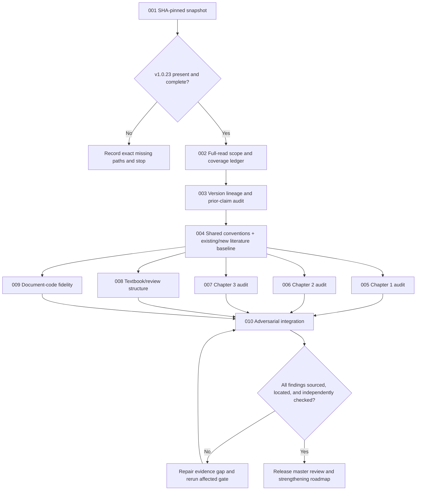

# Project_Anode_Fit v1.0.10-v1.0.23 Chapter 1-3 Scientific Audit and Literature Expansion Master Plan v2

> **For agentic workers:** REQUIRED SUB-SKILL: Use `superpowers:subagent-driven-development` for isolated review packages and `superpowers:verification-before-completion` before every gate. This is a read-only scientific audit and improvement-direction plan; it does not authorize edits to reviewed Claude artifacts or Git state.

**Goal:** Independently determine whether the v1.0.10-v1.0.23 Chapter 1-3 documents and their code are scientifically correct, structurally fit for textbook/review use, and capable of being strengthened with additional verified literature beyond the sources already used.

**Architecture:** Pin the user-intended latest GitHub state by commit SHA without Git operations, build a complete full-read and version-lineage ledger, establish shared thermodynamic/electrochemical conventions, audit Chapters 1-3 independently and across boundaries, map equations to code, then subject all findings and literature recommendations to fresh-context adversarial review.

**Tech Stack:** GitHub read APIs/archive endpoint, SHA256 manifests, Markdown/JSON/CSV evidence ledgers, PowerShell, Python AST and numerical tests, NumPy/SciPy where already required, XeLaTeX/PDF rendering, scholarly search, DOI/official bibliographic metadata, primary papers, authoritative reviews, and textbooks.

---

## Summary

This plan covers only the scientific workstream. Portable Codex configuration updating has been separated into `2026-07-19-portable-codex-config-update-separate-plan.md` and is not a prerequisite, phase, or deliverable of this audit.

The audit answers six questions.

1. What work was actually planned, executed, verified, reversed, or deferred from v1.0.10 through v1.0.23?
2. Are the latest Chapter 1, Chapter 2, and Chapter 3 physically, chemically, mathematically, and inferentially defensible?
3. Are interchapter variables, signs, assumptions, and transfer equations consistent?
4. Do the documents genuinely function as a self-contained textbook and evidence-balanced review, rather than merely using formal prose and many equations?
5. Were the Chapter 1-3 equations and assumptions faithfully implemented in code, including limits, derivatives, examples, and inverse fitting behavior?
6. Which additional papers, reviews, textbooks, or datasets should be used to correct, qualify, extend, or reorganize the documents, and exactly where would each addition strengthen the text?

## Current Ground Truth

- Active project: `D:\Projects\Project_Anode_Fit`.
- Codex output boundary: `D:\Projects\Project_Anode_Fit\Codex`.
- Reviewed Claude and version artifacts are read-only.
- No Git command is authorized; remote content is acquired through read-only GitHub APIs/archive downloads only.
- Local `Claude\docs` currently contains v1.0.10-v1.0.19.
- The connected repository is `lksz1412/Project_Anode_Fit`.
- The currently visible likely work branch is `claude/anode-fit-v1-0-20-cxshf9`.
- Earlier inspection showed v1.0.22 as work in progress and did not find a v1.0.23 handover. Phase 001 must resolve the current state afresh.
- Previous Codex project work is archived under `Codex\old\2026-07-19-pre-v1010-v1023-audit-reset`; this plan starts at Phase 001 and Step 1.
- Chapter 1-3 are all primary review targets. Later chapters are in scope only when required to diagnose a broken transfer or duplicated assumption originating in Chapters 1-3.
- Existing reference lists are audit inputs, not a closed literature universe. New literature discovery and integration proposals are required outputs.

## Phase Range

| Phase | Name | Steps | Primary output | Gate |
|---|---|---:|---|---|
| 001 | SHA-pinned remote snapshot intake | 1-10 | Read-only v1.0.10-v1.0.23 snapshot and manifest | `LATEST_SNAPSHOT_PASS` |
| 002 | Scope freeze and full-read ledger | 11-23 | Complete file/page/range inventory | `FULL_READ_SCOPE_PASS` |
| 003 | Version lineage and prior-claim audit | 24-36 | v1.0.10-v1.0.23 evidence-backed history | `LINEAGE_PASS` |
| 004 | Scientific convention and literature expansion baseline | 37-54 | Convention registry and existing/new source ledgers | `SOURCE_BASELINE_PASS` |
| 005 | Chapter 1 scientific audit and strengthening map | 55-70 | Ch1 defects, validated assets, and literature additions | `CH1_PASS` |
| 006 | Chapter 2 scientific audit and strengthening map | 71-85 | Ch2 defects, validated assets, and literature additions | `CH2_PASS` |
| 007 | Chapter 3 scientific audit and strengthening map | 86-101 | Ch3 defects, validated assets, and literature additions | `CH3_PASS` |
| 008 | Textbook/review structure and three-chapter synthesis | 102-116 | Genre, pedagogy, citation, and reorganization report | `STRUCTURE_PASS` |
| 009 | Chapter 1-3 document-to-code fidelity audit | 117-134 | Equation-code traceability and numerical evidence | `DOC_CODE_PASS` |
| 010 | Fresh-context adversarial integration and handover | 135-147 | Master judgment, defect ledger, improvement roadmap | `MASTER_REVIEW_PASS` |

## Workflow



## Scope Guards

- Do not run any Git command or modify any Git branch, ref, commit, pull request, issue, or remote file.
- Do not modify `D:\Projects\Project_Anode_Fit\Claude` or any reviewed version artifact.
- Do not implement scientific, editorial, or code repairs during this audit; produce exact correction and augmentation directions for a later authorized workstream.
- Do not treat reviewer count, model name, consensus, build success, or regression success as proof of scientific correctness.
- Do not use citation counts or search snippets as source evidence.
- Do not silently replace missing v1.0.23 with v1.0.22.
- Do not broaden Chapter 3 into a general silicon-anode monograph. New sources must directly support, challenge, or complete the model and narrative actually present in the project.
- Do not recommend a source only because it is famous. Every recommended source needs a claim, section, equation, figure, limitation, or comparison role.
- Do not hide company-data-dependent validation behind synthetic PASS results.

## Outputs

- `Codex\results\PHASE_001_LATEST_SNAPSHOT_INTAKE_RESULT.md`
- `Codex\results\PHASE_002_V1010_V1023_FULL_READ_LEDGER.md`
- `Codex\results\PHASE_003_V1010_V1023_LINEAGE_AUDIT_RESULT.md`
- `Codex\results\PHASE_004_SCIENTIFIC_CONVENTION_AND_SOURCE_BASELINE_RESULT.md`
- `Codex\results\PHASE_005_CH1_SCIENTIFIC_AUDIT_AND_STRENGTHENING_RESULT.md`
- `Codex\results\PHASE_006_CH2_SCIENTIFIC_AUDIT_AND_STRENGTHENING_RESULT.md`
- `Codex\results\PHASE_007_CH3_SCIENTIFIC_AUDIT_AND_STRENGTHENING_RESULT.md`
- `Codex\results\PHASE_008_TEXTBOOK_REVIEW_THREE_CHAPTER_STRUCTURE_RESULT.md`
- `Codex\results\PHASE_009_CH1_CH3_DOC_CODE_FIDELITY_RESULT.md`
- `Codex\results\PHASE_010_CLAUDE_WORK_PRODUCT_MASTER_REVIEW.md`
- `Codex\results\PHASE_010_SCIENTIFIC_AUDIT_HANDOVER.md`
- `Codex\results\PHASE_001_010_EXECUTION_LEDGER.md`
- `Codex\results\v1010_v1023_file_manifest.json`
- `Codex\results\v1010_v1023_read_coverage.json`
- `Codex\results\v1010_v1023_version_lineage.csv`
- `Codex\results\existing_reference_verification.csv`
- `Codex\results\additional_literature_candidates.csv`
- `Codex\results\scientific_claim_evidence_ledger.csv`
- `Codex\results\equation_code_traceability.csv`
- `Codex\results\claude_work_product_defect_ledger.csv`

## Model and Effort Allocation

`gpt-5.6-sol` is the final scientific authority. Terra/Luna/Spark may perform inventory, source triage, deterministic extraction, and test execution, but they may not close scientific findings.

| Work | Model | Effort | Parallel allocation | Expected units |
|---|---|---|---:|---:|
| Snapshot and manifest | `gpt-5.6-luna` | medium | 1 | 1-2 |
| Full-read inventory and range tracking | `gpt-5.6-terra` | high | 3-4 non-overlapping ranges | 4-7 |
| Version lineage and claim-vs-artifact audit | `gpt-5.6-sol` | max | 2 independent passes | 4-7 |
| Existing reference verification | `gpt-5.6-sol` | ultra | 2 domain streams | 5-8 |
| Additional literature discovery and triage | `gpt-5.6-terra` | xhigh | 3 topic streams | 5-8 |
| Literature adoption adjudication | `gpt-5.6-sol` | ultra | main integrator | 3-5 |
| Chapter 1 audit | `gpt-5.6-sol` | ultra | 2 independent auditors | 6-10 |
| Chapter 2 audit | `gpt-5.6-sol` | ultra | 2 independent auditors | 6-10 |
| Chapter 3 audit | `gpt-5.6-sol` | ultra | 2 independent auditors | 6-10 |
| Structure/pedagogy review | `gpt-5.6-terra` + `gpt-5.6-sol` | xhigh/max | 2 + integrator | 4-7 |
| Equation-code mapping | `gpt-5.6-sol` | ultra | 1 mapper | 5-8 |
| Deterministic numerical execution | `gpt-5.3-codex-spark` | high | 1 | 2-4 |
| Fresh adversarial integration | `gpt-5.6-sol` | ultra | 2 critics + integrator | 6-10 |

Estimated total: 57-96 agent-session units. This is an evidence estimate, not elapsed time.

## Phase 001 - SHA-pinned Remote Snapshot Intake

- [x] **Step 1:** Re-query repository metadata and branch list through the GitHub connector.
- [x] **Step 2:** Resolve the user-intended work ref from branch freshness and v1.0.23 path evidence.
- [x] **Step 3:** Record the exact branch HEAD commit SHA and observation timestamp.
- [x] **Step 4:** Download a read-only archive for that exact SHA without invoking Git.
- [x] **Step 5:** Extract only under `Codex\work\source_snapshots\<sha>\`.
- [x] **Step 6:** Generate archive and per-file SHA256 manifests.
- [x] **Step 7:** Verify v1.0.10-v1.0.23 directories and shared/version-local plans, results, handovers, TeX, PDF, code, and tests.
- [x] **Step 8:** Compare remote v1.0.10-v1.0.19 hashes with local copies and record divergence.
- [x] **Step 9:** Save the intake result with confirmed non-changes to Git and Claude folders.
- [x] **Step 10:** Close `LATEST_SNAPSHOT_PASS` only if the intended v1.0.23 state is present and pinned.

Hard stop: if v1.0.23 remains unavailable, report exact missing paths and request a push/archive. Do not proceed to Phase 002 under a substituted latest version.

## Phase 002 - Scope Freeze and Full-read Ledger

- [x] **Step 11:** Generate the canonical in-scope inventory from the pinned snapshot.
- [x] **Step 12:** Include every shared plan/roadmap whose target intersects v1.0.10-v1.0.23.
- [x] **Step 13:** Include every cited process result, defect union, source ledger, handover, and code report.
- [x] **Step 14:** Include every version-local plan, result, change log, reference ledger, fitting guide, and snapshot manifest.
- [x] **Step 15:** Include Chapter 1-3 masters, all `\input` sections, appendices, bibliographies, figures, tables, and PDFs.
- [x] **Step 16:** Include matched code, local modules, datasets, regression tests, graph scripts, and fitting demonstrations.
- [x] **Step 17:** Classify each file as full text read, binary visual verification, machine parse plus visual verification, runtime input, or out of scope with reason.
- [x] **Step 18:** Record line/page counts and assign non-overlapping ranges.
- [x] **Step 19:** Read project instructions, INDEX, master roadmaps, ledgers, and handover chain first.
- [x] **Step 20:** Read every required text/code file first-to-last and every required PDF page, recovering truncated ranges.
- [x] **Step 21:** Require each worker report to state files, ranges, confirmed evidence, conflicts, and unverified items.
- [x] **Step 22:** Reconcile worker reports against the machine inventory.
- [x] **Step 23:** Close `FULL_READ_SCOPE_PASS` only with zero undisposed in-scope files.

## Phase 003 - Version Lineage and Prior-claim Audit

- [x] **Step 24:** Reconstruct the version graph, split versions, supersessions, freezes, and chapter reorganizations.
- [x] **Step 25:** Extract each version's goal, base, model workflow, decisions, planned changes, results, artifacts, code, tests, and debt.
- [x] **Step 26:** Compare plans against results and ledgers.
- [x] **Step 27:** Compare result/handover claims against final artifacts.
- [x] **Step 28:** Produce semantic and structural diffs for Chapters 1-3, fitting guides, and code.
- [x] **Step 29:** Track equations, labels, assumptions, caveats, figures, references, examples, APIs, and asset identities.
- [x] **Step 30:** Distinguish deliberate deletion, relocation, compression, expansion, and accidental loss.
- [x] **Step 31:** Re-test closure of previously reported Critical/High defects.
- [x] **Step 32:** Identify recurrence and regression in later versions.
- [x] **Step 33:** Audit claims such as zero physics defects, complete asset retention, matched code, or verified bibliography.
- [x] **Step 34:** Identify which model-authored transition materially changed scientific content.
- [x] **Step 35:** Run a second independent lineage pass attempting to falsify the first.
- [x] **Step 36:** Save the lineage report with `확정/미결/근거 미발견/추정/미검증` status; Phase 003 closes at `LINEAGE_AUDIT_COMPLETE`, while `LINEAGE_PASS` remains open for five release-control adjudications.

## Phase 004 - Scientific Convention and Literature Expansion Baseline

- [x] **Step 37:** Build shared symbol, sign, unit, normalization, and reference-state registries for Chapters 1-3 and code.
- [x] **Step 38:** Build the dependency graph from composition and state fractions through potential, ICA/DVA, entropy, heat, kinetics, mechanics, and fitting outputs.
- [x] **Step 39:** Separate exact identities, equilibrium relations, near-equilibrium approximations, phenomenological laws, fitting ansatzes, and numerical devices.
- [x] **Step 40:** Extract every source actually cited by Chapters 1-3 and their reference ledgers.
- [x] **Step 41:** Verify bibliographic identity, DOI/official URL, source type, cited passage, and claim strength for every load-bearing source.
- [x] **Step 42:** Mark existing sources as `supports`, `partially supports`, `contradicts`, `misattributed`, `insufficient`, or `not retrieved`.
- [x] **Step 43:** Derive a literature-gap taxonomy from unsupported claims, unmodeled mechanisms, weak comparisons, and pedagogical gaps.
- [x] **Step 44:** Search primary literature for graphite staging, thermodynamic factors, ICA/DVA peak formation, size/disorder broadening, kinetics, hysteresis, and inverse identifiability.
- [x] **Step 45:** Search primary literature for LCO phase transitions, electronic/configurational/vibrational entropy, calorimetry, potentiometry, MSMR, and reversible heat.
- [x] **Step 46:** Search primary literature for Si, SiOx, Si-C blends, phase transformation, amorphization, stress-coupled chemical potential, Larché-Cahn thermodynamics, hysteresis, and active-material loss boundaries.
- [x] **Step 47:** Search authoritative reviews and textbooks that can supply missing prerequisite or taxonomy structure without replacing primary evidence.
- [x] **Step 48:** Search for modern methods on parameter identifiability, Bayesian or uncertainty-aware fitting, regularization, and experimental design relevant to ICA/DVA.
- [x] **Step 49:** Screen each new source for direct relevance, methodological quality, material/system match, temperature/rate regime, and transferability.
- [x] **Step 50:** Record every candidate's exact integration role: correction, qualification, derivation support, competing mechanism, figure/table, parameter prior, experimental validation, or future-work boundary.
- [x] **Step 51:** Reject attractive but non-transferable sources explicitly rather than leaving selection bias invisible.
- [x] **Step 52:** Independently re-derive load-bearing sign chains and dimensional relations using the fixed registry.
- [x] **Step 53:** Define analytic limits, numerical corner cases, and identifiability questions for later phases.
- [x] **Step 54:** Close `SOURCE_BASELINE_PASS` only when existing and additional sources are traceable to specific claims and sections.

## Phase 005 - Chapter 1 Scientific Audit and Strengthening Map

- [x] **Step 55:** Read the latest Chapter 1 master, included sections, appendices, bibliography, figures, tables, fitting references, and handover in full.
- [x] **Step 56:** Build the Chapter 1 equation and assumption DAG.
- [x] **Step 57:** Re-derive charge balance, internal/apparent/equilibrium potentials, occupancy, ICA/DVA derivatives, peaks, broadening, lag, hysteresis, and summation.
- [x] **Step 58:** Check dimensions, normalization, signs, domains, and numerical examples.
- [x] **Step 59:** Test zero interaction/broadening/current/lag, one-reaction, separated/overlapped reactions, identical centers, and phase-boundary limits.
- [x] **Step 60:** Separate thermodynamic width, ensemble heterogeneity, PSD, kinetic dispersion, transport, and measurement convolution.
- [x] **Step 61:** Audit graphite staging and LCO content retained in Chapter 1 against primary evidence and declared scope.
- [x] **Step 62:** Audit hysteresis and memory for causality, state dependence, thermodynamic admissibility, and double counting.
- [x] **Step 63:** Audit inverse identifiability from peak position, area, width, skew, overlap, temperature, and rate dependence.
- [x] **Step 64:** Compare with earlier versions for regression, caveat loss, and confidence escalation.
- [x] **Step 65:** Match every confirmed gap to existing or newly found literature.
- [x] **Step 66:** Specify exact section-level additions, deletions, qualifications, derivations, figures, or comparison tables that would strengthen Chapter 1.
- [x] **Step 67:** Distinguish required correction from optional enrichment.
- [x] **Step 68:** Run an independent Sol refutation pass for every Critical/High finding and source recommendation.
- [x] **Step 69:** Save findings with file/line/page, derivation, source, severity, confidence, and code impact.
- [x] **Step 70:** Evaluate `CH1_PASS`; all claims were disposed, but unresolved Critical/High findings prevent closure.

## Phase 006 - Chapter 2 Scientific Audit and Strengthening Map

- [x] **Step 71:** Read the latest Chapter 2 master and all dependent artifacts in full.
- [x] **Step 72:** Reconstruct ensemble, partition-function, chemical-potential, entropy, entropy-coefficient, and reversible-heat chains.
- [x] **Step 73:** Re-derive configurational entropy and partial-molar derivatives in the actual occupancy convention.
- [x] **Step 74:** Re-derive vibrational and electronic terms, limits, and reference cancellations.
- [x] **Step 75:** Re-derive electrode/cell entropy coefficient and reversible heat under declared current/voltage signs.
- [x] **Step 76:** Check mixing/overlap additivity, weighting, normalization, and double counting.
- [x] **Step 77:** Check phase separation, metastability, calorimetry, and hysteresis boundaries.
- [x] **Step 78:** Recompute all worked values and figure-driving data.
- [x] **Step 79:** Audit cited calorimetry, potentiometry, first-principles, MSMR, and heat literature.
- [x] **Step 80:** Compare transfer variables and branch averages against Chapters 1 and 3.
- [x] **Step 81:** Match every confirmed gap to existing or newly found literature.
- [x] **Step 82:** Specify exact additions, qualifications, derivations, figures, and comparison tables for Chapter 2.
- [x] **Step 83:** Run an independent Sol sign/derivative/partial-molar/heat refutation pass.
- [x] **Step 84:** Save the evidence-backed Chapter 2 report.
- [x] **Step 85:** Evaluate `CH2_PASS`; all chains were disposed, but unresolved Critical/High findings prevent closure.

## Phase 007 - Chapter 3 Scientific Audit and Strengthening Map

- [x] **Step 86:** Read the latest Chapter 3 master, sections, appendices, bibliography, figures, tables, code references, and handover in full.
- [x] **Step 87:** Identify the exact Chapter 3 material scope: Si, SiOx, Si-C, blend fractions, and any graphite/LCO comparisons.
- [x] **Step 88:** Build the equation/assumption DAG for phase state, electrochemical potential, mechanics, kinetics, hysteresis, and blend coupling.
- [x] **Step 89:** Re-derive common-chemical-potential or grand-canonical balance used for blended materials.
- [x] **Step 90:** Re-derive stress-coupled chemical potential and verify Larché-Cahn assumptions, sign, reference state, and small/finite-strain domain.
- [x] **Step 91:** Audit crystalline-to-amorphous transformations, two-phase/single-phase descriptions, path dependence, and voltage hysteresis against material evidence.
- [x] **Step 92:** Audit SiOx and Si-C transfer assumptions and distinguish active Si, inactive matrix, irreversible conversion, and graphite contributions.
- [x] **Step 93:** Check blend capacity/stoichiometry normalization and whether common-potential coupling preserves charge and material fractions.
- [x] **Step 94:** Audit particle-size, stress, fracture, SEI, loss-of-active-material, and transport mechanisms for model inclusion versus explicit exclusion.
- [x] **Step 95:** Check identifiability of blend fraction, active fraction, stress parameters, hysteresis, and degradation from ICA/DVA alone.
- [x] **Step 96:** Compare Chapter 3 variables and transfer equations against Chapters 1 and 2 and code.
- [x] **Step 97:** Match every confirmed gap to existing or newly found literature.
- [x] **Step 98:** Specify exact section-level corrections, literature additions, mechanism comparison tables, figures, and scope caveats.
- [x] **Step 99:** Run an independent Sol mechanics/electrochemistry/materials refutation pass.
- [x] **Step 100:** Save findings with exact locations, equations, sources, severity, confidence, and code impact.
- [x] **Step 101:** Evaluate `CH3_PASS`; all chains were disposed, but seven High findings prevent closure.

## Phase 008 - Textbook/Review Structure and Three-chapter Synthesis

- [x] **Step 102:** Build section-purpose maps for Chapters 1-3.
- [x] **Step 103:** Check prerequisite closure and conceptual dependency order.
- [x] **Step 104:** Check notation introduction, reuse, local/global definitions, and appendix placement.
- [x] **Step 105:** Check equation-to-prose balance and whether derivations expose physical premises.
- [x] **Step 106:** Check examples for provenance, units, reproducibility, and representativeness.
- [x] **Step 107:** Label established results, literature models, project adaptations, phenomenology, numerical devices, hypotheses, and future work.
- [x] **Step 108:** Check citation placement, competing explanations, negative evidence, and unresolved questions.
- [x] **Step 109:** Check whether the three-chapter material split improves or obscures the thermodynamic spine.
- [x] **Step 110:** Check cross-chapter transitions and duplicated or silently redefined assumptions.
- [x] **Step 111:** Check authoring-process residue, defensive repetition, API leakage, and overclaiming.
- [x] **Step 112:** Compare the latest structure against v1.0.19-v1.0.22 and the stated textbook/review goal.
- [x] **Step 113:** Evaluate each chapter separately for textbook quality, review quality, and fitting usability.
- [x] **Step 114:** Produce a section-level reorganization and literature-placement map without rewriting source files.
- [x] **Step 115:** Run independent Terra scoring followed by Sol adjudication.
- [x] **Step 116:** Close `STRUCTURE_PASS` only when all three chapters and their synthesis are separately judged; the adjudicated gate is conditional: `STRUCTURE_PASS_WITH_REQUIRED_REORGANIZATION`.

## Phase 009 - Chapter 1-3 Document-to-code Fidelity Audit

- [x] **Step 117:** Identify latest code and all local modules/data/tests/examples.
- [x] **Step 118:** Copy runtime inputs into isolated `Codex\work\audit_runtime\<sha>\`.
- [x] **Step 119:** Parse Chapter 1-3 equations, inputs, outputs, defaults, branches, and switches.
- [x] **Step 120:** Parse code symbols with AST and map every load-bearing equation.
- [x] **Step 121:** Classify exact, numerical, approximate, code-only, document-only, naming-mismatch, and unmapped behavior.
- [x] **Step 122:** Re-run existing tests and examples in a recorded environment.
- [x] **Step 123:** Test charge/material conservation and composition normalization across three chapters.
- [x] **Step 124:** Test signs, branch behavior, reversible/irreversible heat, and stress-potential coupling.
- [x] **Step 125:** Verify analytic derivatives with finite differences or automatic differentiation.
- [x] **Step 126:** Test zero-interaction/broadening/lag/current/stress/blend limits and optional-physics absence.
- [x] **Step 127:** Inspect/reproduce document examples, tables, and existing code-generated figures within the read-only phase boundary.
- [x] **Step 128:** Run synthetic forward/inverse tests for correlation, non-identifiability, and initialization sensitivity.
- [x] **Step 129:** Test Chapter 3 blend and mechanical mappings separately from graphite/LCO paths.
- [x] **Step 130:** Check API usability from documents alone.
- [x] **Step 131:** Compare code behavior with newly verified literature constraints where those constraints are already claimed by the documents.
- [x] **Step 132:** Have Sol distinguish code mismatch, invalid document equation, numerical approximation, and underdetermined inverse problem.
- [x] **Step 133:** Save traceability and numerical evidence.
- [x] **Step 134:** Evaluate `DOC_CODE_PASS`; 190/190 labels have status, but five High findings produce FAIL.

## Phase 010 - Fresh-context Adversarial Integration and Handover

- [x] **Step 135:** Merge findings without erasing conflicts or different root causes.
- [x] **Step 136:** Assign Critical/High/Medium/Low severity and evidence status.
- [x] **Step 137:** Separate confirmed correctness from merely unrefuted content.
- [x] **Step 138:** Dispatch a fresh Sol critic for physics/chemistry/mathematics findings.
- [x] **Step 139:** Dispatch a fresh Sol critic for literature, structure, history, and code findings.
- [x] **Step 140:** Re-read and recalculate every disputed Critical/High finding.
- [x] **Step 141:** Produce version-by-version and Chapter 1/2/3 judgments.
- [x] **Step 142:** Produce textbook, review, fitting-usability, and code-fidelity judgments.
- [x] **Step 143:** Rank immediate corrections, high-value literature enrichments, model extensions, data-dependent validations, and optional editorial changes.
- [x] **Step 144:** For every recommended new source, state exact purpose, target section, expected change, and adoption risk.
- [x] **Step 145:** Reconcile final claims against read coverage and source retrieval status.
- [x] **Step 146:** Validate Markdown/CSV/JSON, paths, DOI links, arithmetic, and hashes.
- [x] **Step 147:** Save master review, defect ledger, strengthening roadmap, ledger, and handover; close `MASTER_REVIEW_PASS` only with direct answers to all six questions.

## Evidence Interfaces

```text
read_coverage: file_path | sha256 | total_lines_or_pages | reviewed_ranges | mode | reviewer | status | truncation_rechecks | notes
existing_source: source_id | citation_key | bibliographic_identity | DOI_or_official_URL | cited_locations | cited_claim | support_status | retrieval_status | notes
new_source: candidate_id | bibliographic_identity | DOI_or_official_URL | source_type | topic | direct_relevance | target_chapter_section | integration_role | evidence_quality | transfer_risk | adoption_status
claim: claim_id | version | chapter | source_location | claim_class | convention | derivation | dimensions | literature | status | finding_id
traceability: trace_id | chapter | equation_label | document_location | code_symbol | code_location | inputs | outputs | units | signs | class | numeric_test | status
finding: finding_id | domain | severity | status | versions | location | finding | effect | evidence | independent_check | correction_or_strengthening | code_impact | confidence
```

## Gate Rules

- `READ_FULL` requires uninterrupted first-to-last line/page coverage and re-reading truncated ranges.
- Every Critical/High finding requires an independent refutation attempt.
- Every literature recommendation requires verified bibliographic identity and an exact integration role.
- Missing paywalled or unavailable full text is `미검증`; an abstract cannot support equation-level adoption.
- Existing project sources and newly found sources are recorded separately.
- Synthetic validation cannot close company-data-dependent claims.
- Build/import/test success cannot close scientific logic by itself.

## Correction History

- 2026-07-19 v2: Removed portable Codex configuration updating from the scientific workstream and placed it in a separate parked plan.
- 2026-07-19 v2: Expanded primary scope from Chapters 1-2 to Chapters 1-3.
- 2026-07-19 v2: Added systematic verification of existing references, discovery of additional primary/review/textbook sources, source adoption adjudication, and section-level strengthening maps.
- 2026-07-19 v2: Reset scientific execution to Phase 001 Step 1, beginning with SHA-pinned snapshot intake.
- 2026-07-20 v2: Closed Phase 010 after two fresh Sol refutation passes, deduplicated the LCO ordering-model root into `P6-CH2-009`, resolved the MCMB factor-of-ten dispute from the full primary PDF, and recorded `MASTER_REVIEW_PASS` for the audit deliverable only.
