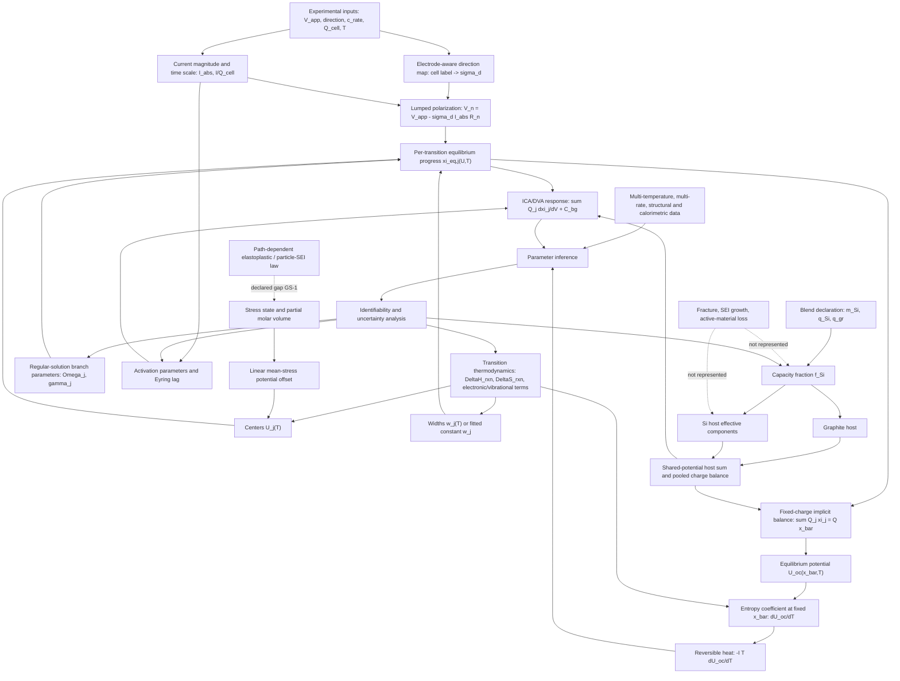

# Phase 004 Model Dependency Graph

Status: working baseline for the Chapter 1-3 scientific audit. An edge labelled `declared gap` is intentionally not closed by v1.0.23.

## Edge Classes

| Class | Meaning | Current audit use |
|---|---|---|
| Exact accounting identity | Charge/capacity conservation and host summation after the normalization basis is fixed | Re-derive and unit-test |
| Equilibrium relation | Chemical-potential balance, logistic response, and implicit inversion | Check signs, reference states, and domains |
| Near-equilibrium approximation | Lumped resistance, low-rate entropy measurement, reduced heat balance | Require rate and relaxation limits |
| Phenomenological law | Effective transition components, fitted widths, branch shrinkage, and lag kernel | Prevent microscopic over-interpretation |
| Numerical device | Bisection, clipped logit, seed lag, and ratio correction | Test convergence and ensure it is not presented as new physics |
| Declared missing closure | Si plasticity/current partition/nonadditivity and damage evolution | Preserve as a boundary; propose evidence-backed next models |

## Confirmed Broken Or Ambiguous Edges

1. `c_rate -> I/Q_cell -> Eyring lag`: hours are passed into a seconds-based attempt-frequency expression without conversion.
2. `m_Si -> f_Si -> host capacities`: the fraction is correct, but the implementation holds graphite capacity fixed, so absolute capacity is on a fixed-graphite-add-Si basis rather than a fixed-total-mass blend basis.
3. `biaxial thin-film stress measurement -> mean-stress coefficient`: the source and chapter differentiate with respect to different stress variables.
4. `small-strain Larché-Cahn term -> high-lithiation Si`: the source itself warns that finite kinematics and high solute concentration can produce substantial errors.
